# The GAML Editor - Generalities

The GAML Editor is a text editor that proposes several services to support the modeler in writing correct models: an integrated live validation system, a ribbon header that gives access to [experiments](G__LaunchingExperiments), information, warning and error markers.

## Table of contents 

* [The GAML Editor - Generalities](#the-gaml-editor-generalities)
	* [Creating a first model](#creating-a-first-model)
	* [Status of models in editors](#status-of-models-in-editors)
	* [Editor Preferences](#editor-preferences)
	* [Multiple editors](#multiple-editors)
	* [Local history](#local-history)

## Creating a first model

Editing a model requires that at least one **project** is created in _User Models_. If there is none, right-click on _User Models_ and choose "New… > Gama Project…" (if you already have user projects and want to create a model in one of them, skip the next step).

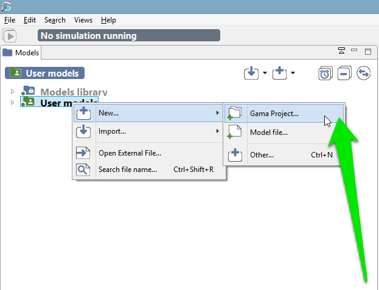

A dialog is then displayed, offering you to enter the name of the project as well as its location on the filesystem. Unless you are absolutely sure of what you are doing, keep the "Use default location" option checked. An error will be displayed if the project name already exists in the workspace, in which case you will have to change it. Two projects with similar names can not coexist in the workspace (even if they belong to different categories).

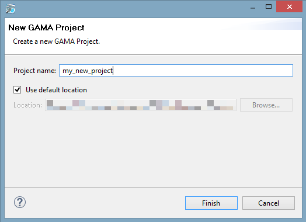

Once the project is created (or if you have an existing project), navigate to it and right-click on it. This time, choose "New…>Model file…" to create a new model.

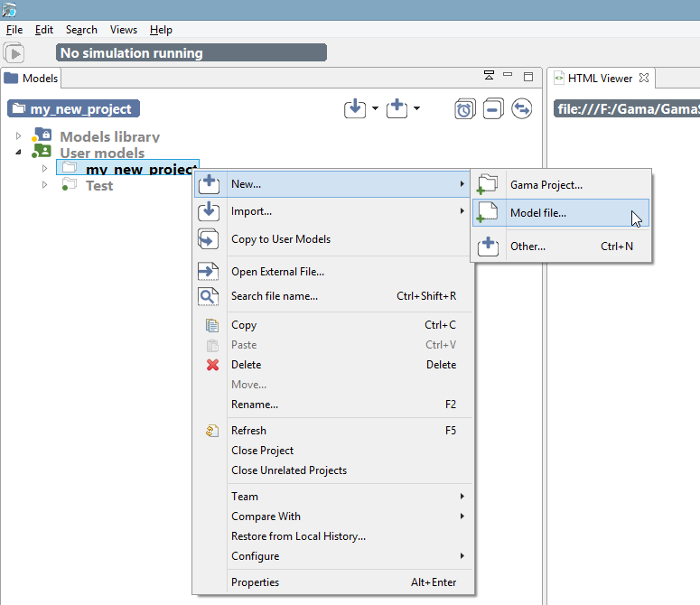

A new dialog is displayed, which asks for several required or optional information. The _Container_ is normally the name of the project you have selected, but you can choose to place the file elsewhere. An error will be displayed if the container does not exist (yet) in the workspace. You can then choose whether you want to use a template or not for producing the initial file, and you are invited to give this file a name. An error is displayed if this name already exists in this project. The name of the model, which is by default computed with respect to the name of the file, can be actually completely different (but it may not contain white spaces or punctuation characters). The name of the author, as well as the textual description of the model and the creation of an HTML documentation, are optional.

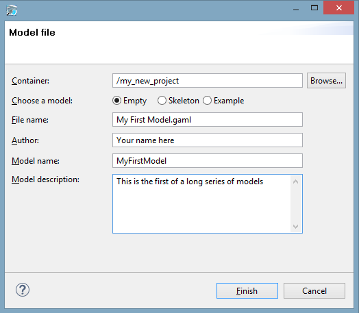

## Status of models in editors

Once this dialog is filled and accepted, GAMA will display the new "empty" model.

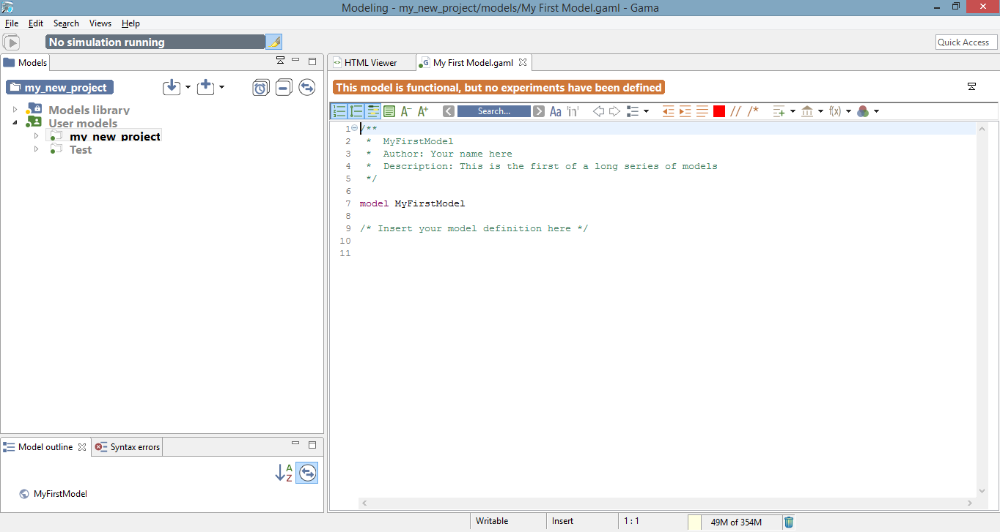

Although GAML files are just plain text files, and can therefore be produced or modified in any text processor, using the dedicated GAML editor offers a number of advantages, among which the live display of errors and model statuses. A model can actually be in four different states, which are visually accessible above the editing area: _Functional_ (orange color), _Experimentable_ (green color), _InError_ (red color), InImportedError_(yellow color). See [the section on model compilation](G__ValidationOfModels) for more precise information about these statuses._

In its initial state, a model is always in the _Functional_ state, which means it compiles without problems, but cannot be used to launch experiments. The _InError_ state, depicted below, occurs when the file contains errors (syntactic or semantic ones).

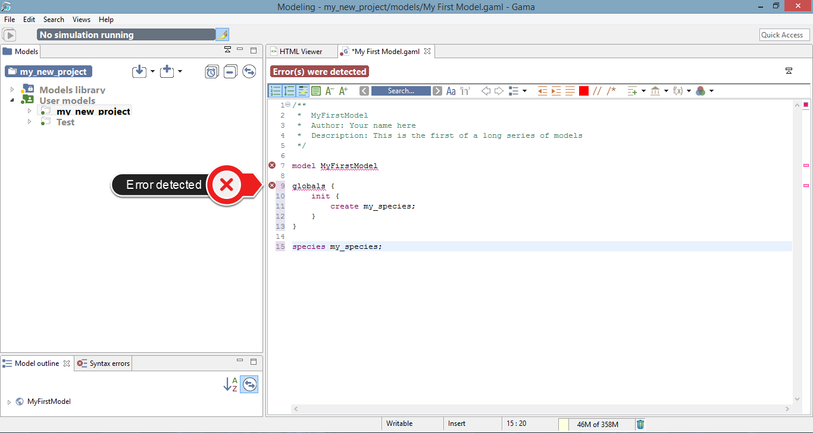

While the file is not saved, these errors remain displayed in the editor and nowhere else. If you save the file, they are now considered as "workspace errors" and get displayed in the "Problems" view below the editor.

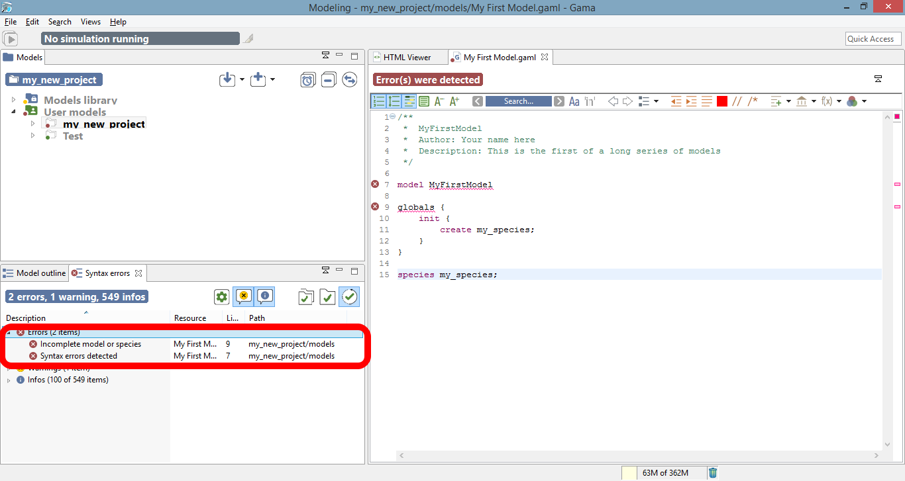

Reaching the _Experimentable_ state requires that all errors are eliminated and that at least one experiment is defined in the model, which is the case now in our toy model. The experiment is immediately displayed as a button in the toolbar, and clicking on it will allow to launch this experiment on your model. See [the section about running experiments](G__RunningExperiments) for more information on this point.

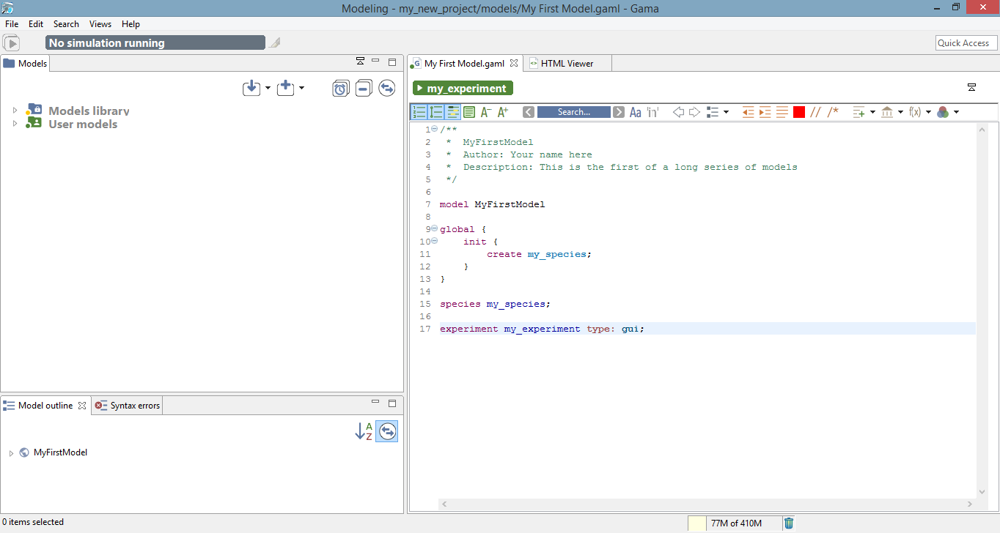

Experiment buttons are updated in real-time to reflect what's in your code. If more than one experiment is defined, corresponding buttons will be displayed in addition to the first one.

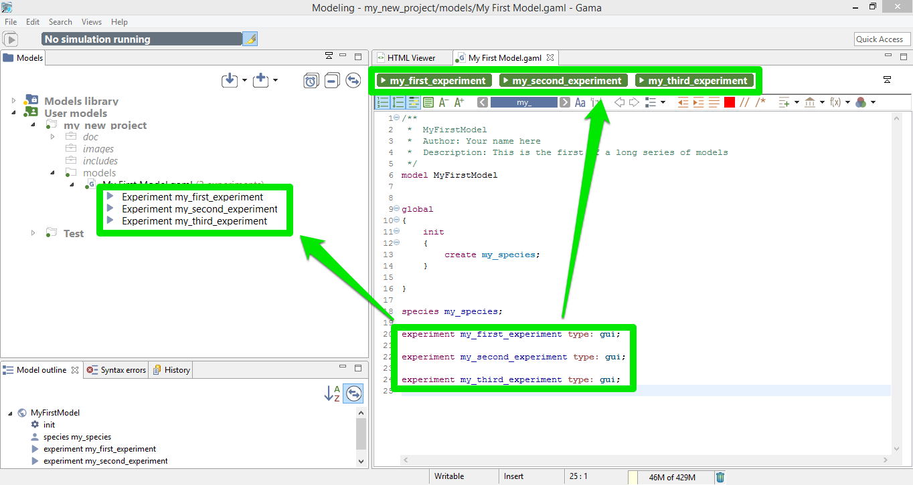

## Editor Preferences

Text editing in general, and especially in Eclipse-based editors, sports a number of options and preferences. You might want to turn off/on the numbering of the lines, change the fonts used, change the colors used to highlight the code, etc. All of these preferences are accessible from the "Preferences…" item of the editor contextual menu.

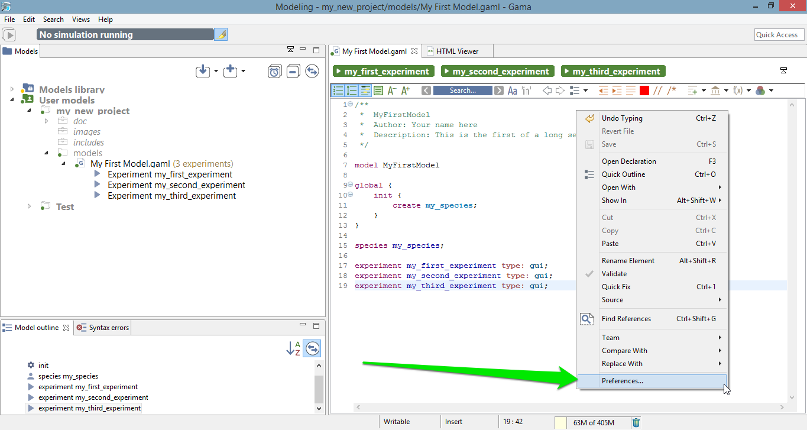

Explore the different items present there, keeping in mind that these preferences will apply to all the editors of GAMA and will be stored in your workspace.

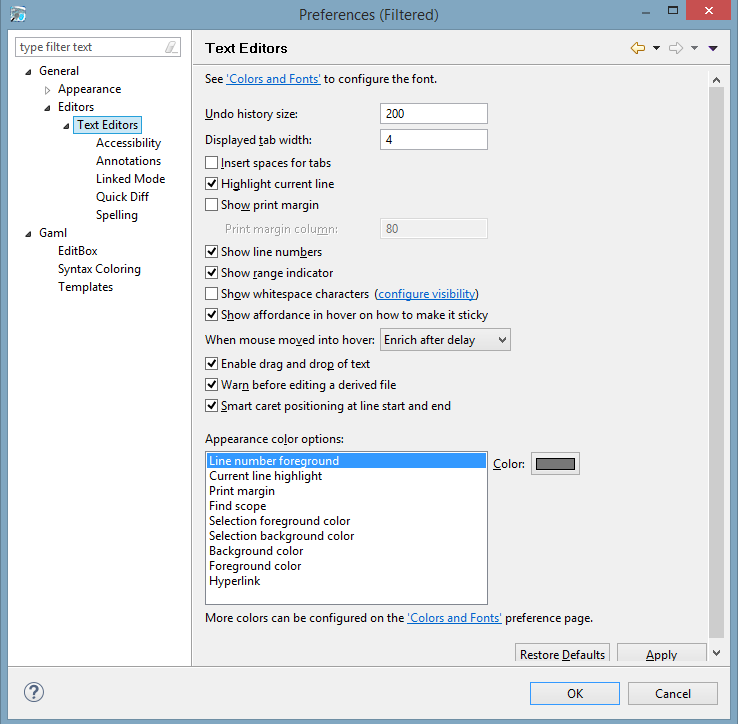

## Additional informations in the Editor

You can choose to display or not some informations in your Editor

One particular option, shipped by default with GAMA, is the possibility to not only highlight the code of your model, but also its structure (complementing, in that sense, the _Outline_ view). It is a slightly modified version of a plugin called [EditBox](http://sourceforge.net/projects/editbox/), which can be activated by clicking on the "green square" icon in the toolbar.

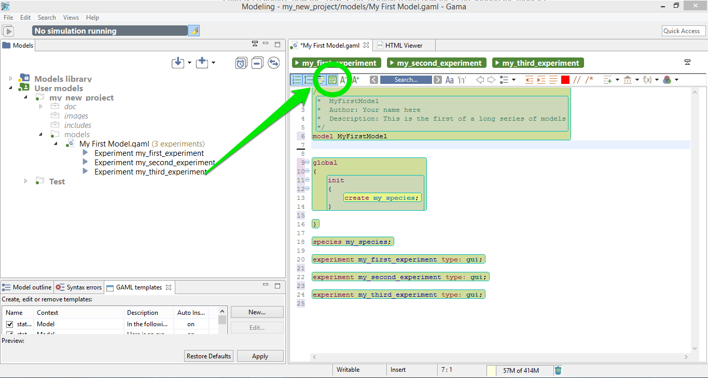

The Default theme of [EditBox](http://sourceforge.net/projects/editbox/) might not suit everyone's tastes, so the preferences allow to entirely customize how the "boxes" are displayed and how they can support the modeler in better understanding "where" it is in the code. The "themes" defined in this way are stored in the workspace, but can also be exported for reuse in other workspaces, or sharing them with other modelers.

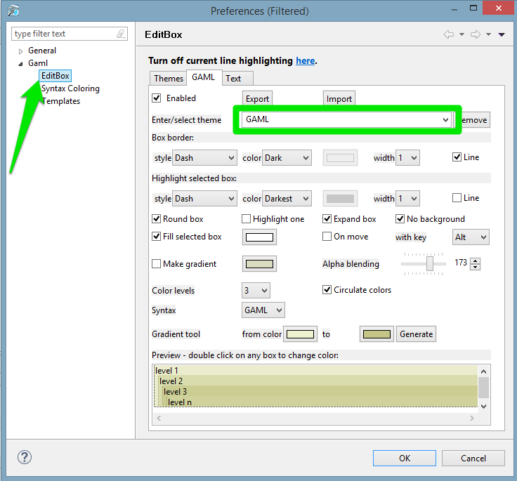

## Multiple editors
GAMA inherits from [Eclipse](http://www.eclipse.org) the possibility to entirely configure the placement of the views, editors, etc. This can be done by rearranging their position using the mouse (click and hold on an editor's title and move it around). In particular, you can have several editors side by side, which can be useful for viewing the documentation while coding a model.

## Local history
Among the various options present to work with models, which you are invited to try out and test at will, one, called _Local history_ is particularly interesting and worth a small explanation. When you edit models, GAMA keeps in the background all the successive versions you save (the history duration is configurable in the preferences), whether or not you are using a versioning system like SVN or Git. This local history is accessible from different places in GAMA (the _Navigator_, the _Views_ menu, etc.), including the contextual menu of the editor.

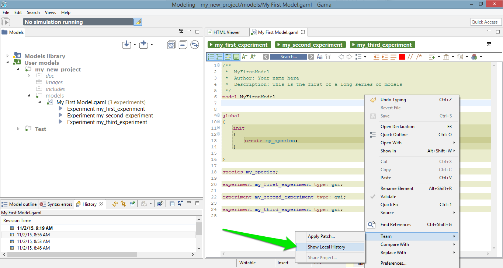

This command invokes the opening of a new view, which you can see on the figure below, and which lists the different versions of your file so far. You can then choose one and, right-clicking on it, either open it in a new editor, or compare it to your current version.

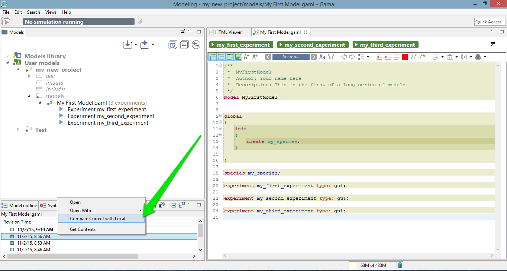

This allows you to precisely pinpoint the modifications brought to the file and, in case of problems, to revert them easily, or even revert the entire file to a previous version. Never lose your work again !

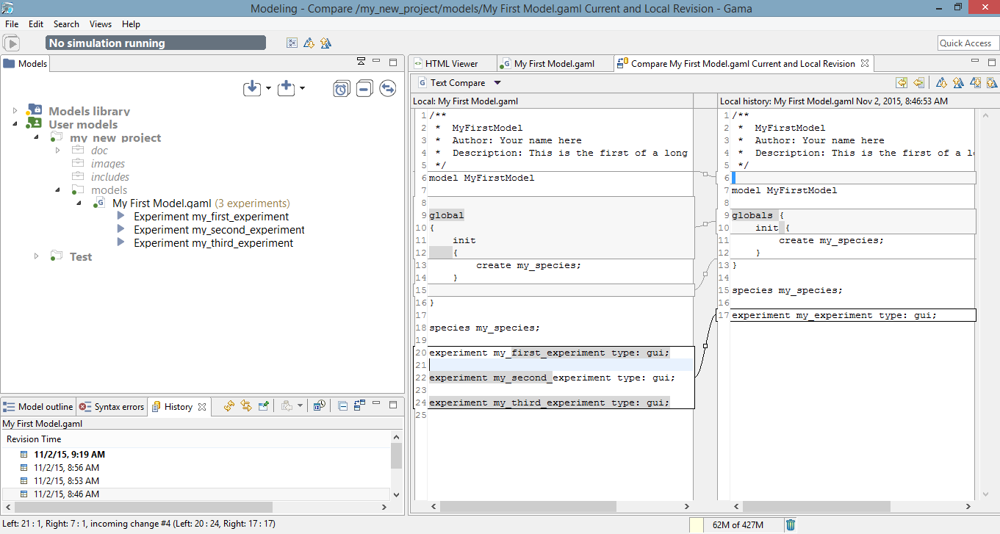

This short introduction to GAML editors is now over. You might want to take a look, now, at [how the models you edit are parsed, validated and compiled](G__ValidationOfModels), and how this information is accessible to the modeler.
