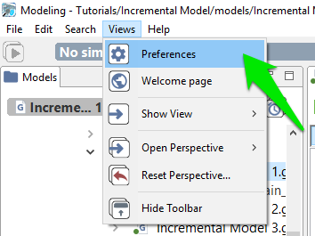
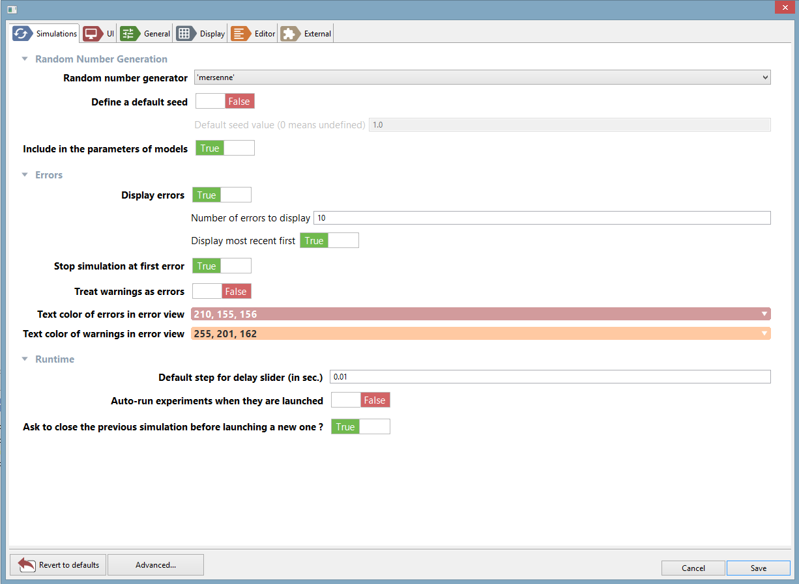
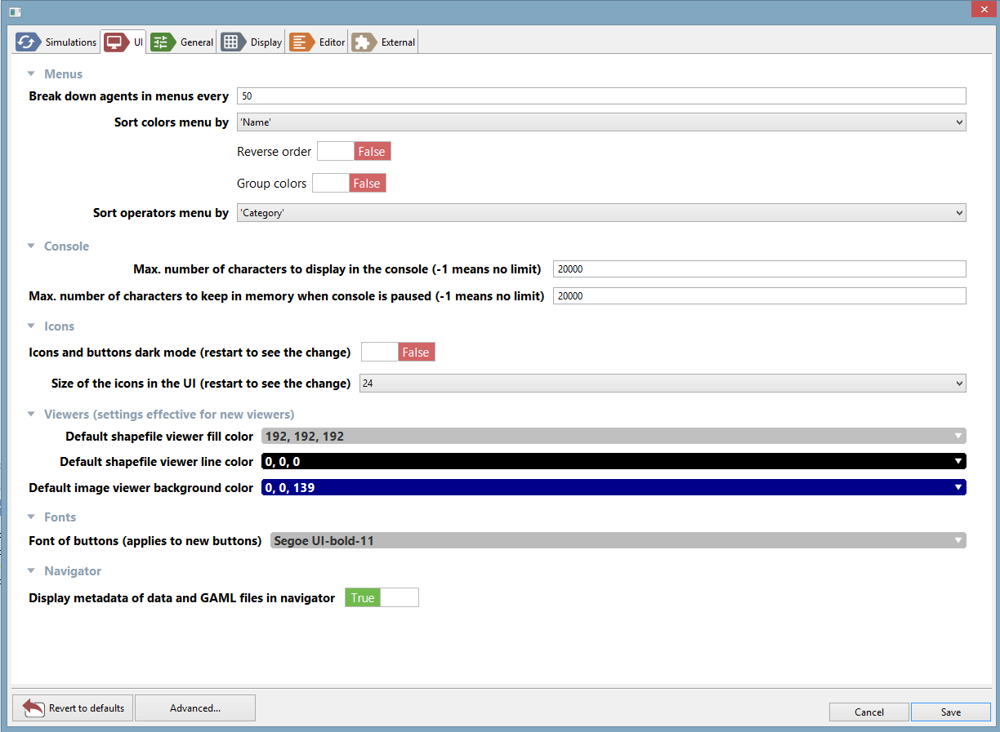
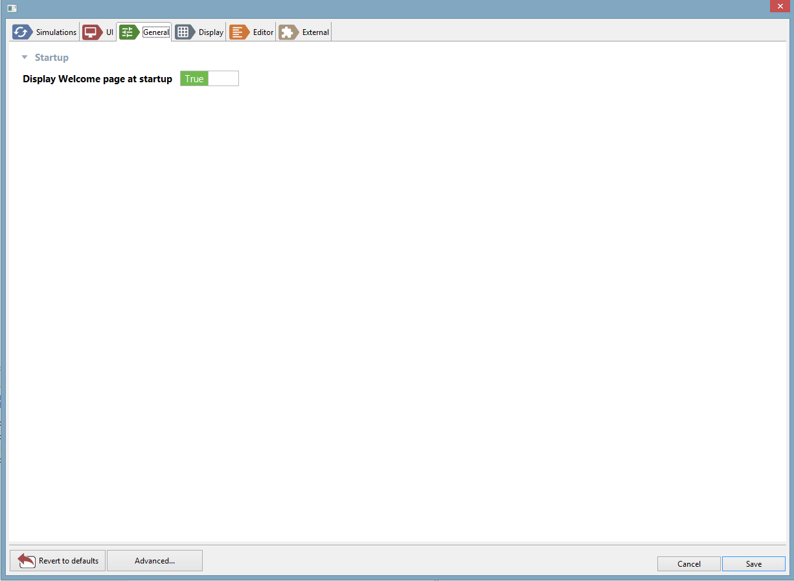
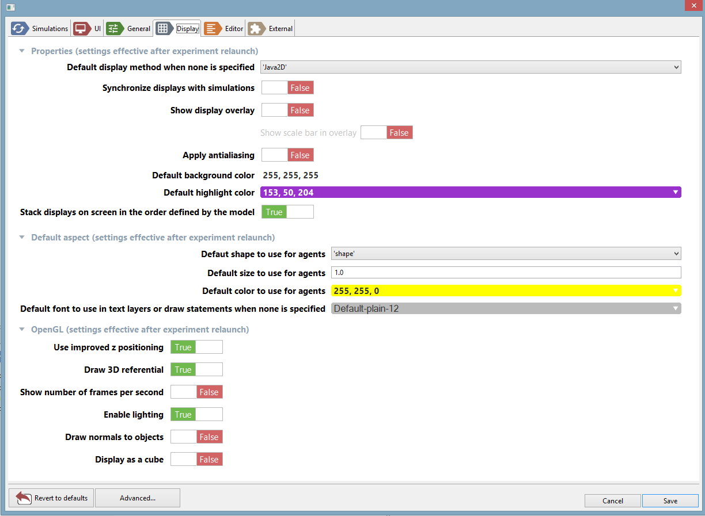
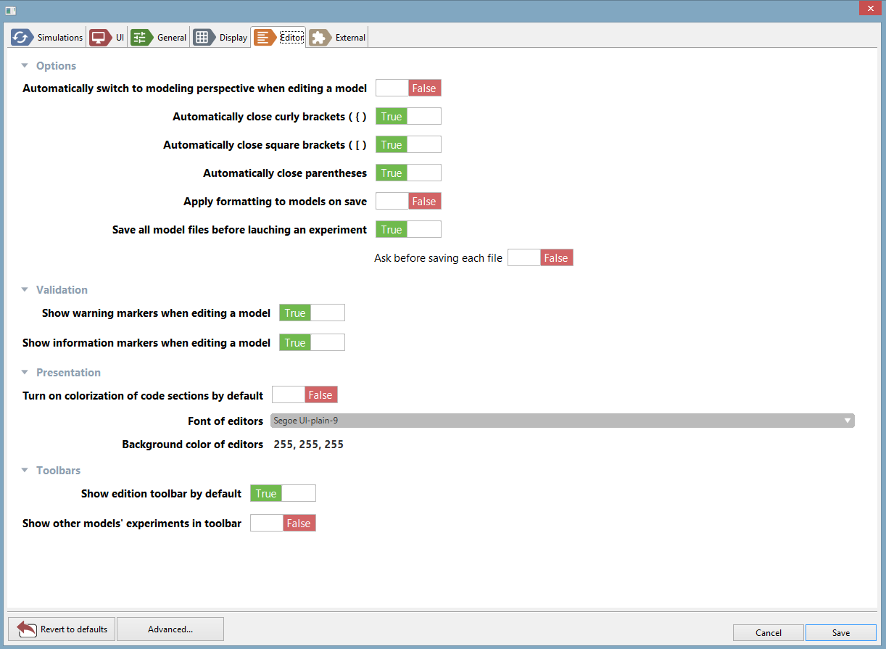
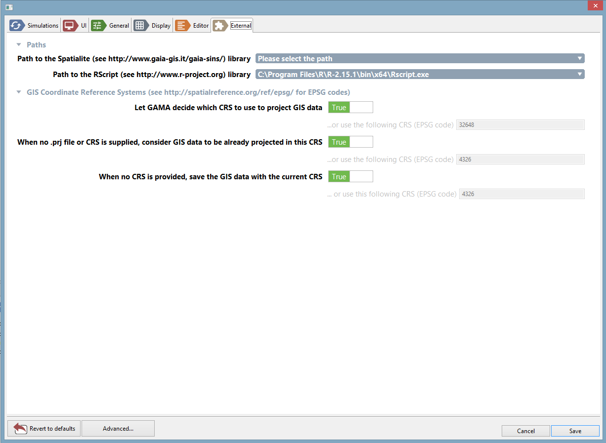
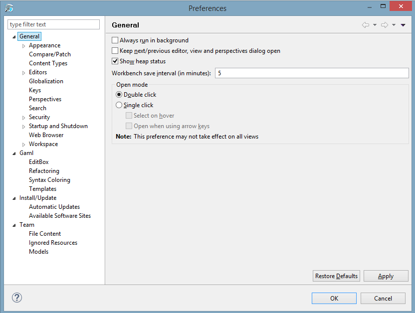

# Preferences

Various preferences are accessible in GAMA to allow users and modelers to personalize their working environment. This section review the different preference tabs available in the current version of GAMA, as well as how to access the preferences and settings inherited by GAMA from Eclipse.

Please note that the preferences specific to GAMA will be shared, on a same machine, and for a same user, among all the workspaces managed by GAMA. [Changing workspace](https://github.com/gama-platform/gama/wiki/Content\References\PlatformDocumentation\WorkspaceProjectsAndModels\ChangingWorkspace.md) will not alter them. If you happen to run several instances of GAMA, they will also share these preferences.

## Table of contents 

* [Preferences](#preferences)
	* [Opening Preferences](#opening-preferences)
	* [Simulation](#simulation)
	* [Display](#display)
	* [Editor](#editor)
	* [External](#external)
	* [Advanced Preferences](#advanced-preferences)

## Opening Preferences
To open the preferences dialog of GAMA, either click on the small "form" button on the top-left corner of the window or select "Preferences…" from the Gama, "Help" or "Views" menu depending on your OS.

## Simulation

  * **Random Number Generation**: all the options pertaining to generating random numbers in simulations
    * Random Number Generator: the name of the generator to use by default (if none is specified in the model).
    * Define a default seed: whether or not a default seed should be used if none is specified in the model  (otherwise it is chosen randomly by GAMA)
    * Default Seed value: the value of this default seed
    * Include in the parameters of models: whether the choice of generator and seed is included by default in the [parameters views](https://github.com/gama-platform/gama/wiki/Content\References\PlatformDocumentation\RunningExperiments\ParametersView.md) of experiments or not.
  * **Errors**: how to manage and consider simulation errors
    * Display Errors: whether errors should be displayed or not.
    * Number of errors to display: how many errors should be displayed at once
    * Display most recent first: errors will be sorted in the inverse chronological order if true.
    * Stop simulation at first error: if false, the simulations will display the errors and continue (or try to).
    * Treat warnings as errors: if true, no more distinction is made between warnings (which do not stop the simulation) and errors (which can potentially stop it.
  * **Runtime**: various settings regarding the execution of experiments.
    * Default Step for Delay Slider: the number of seconds that one step of the slider used to impose a delay between two cycles of a simulation lasts.
    * Auto-run experiments when they are launched: see [this page](https://github.com/gama-platform/gama/wiki/Content\References\PlatformDocumentation\RunningExperiments\LaunchingExperiments.md#Running_Experiments_Automatically).
    * Ask to close the previous simulation before launching a new one: if false, previous simulations (if any) will be closed without warning.

    
## UI

  * **Menus**
    * Break down agents in menu every: when [inspecting](https://github.com/gama-platform/gama/wiki/Content\References\PlatformDocumentation\RunningExperiments\InspectorsAndMonitors.md) a large number of agents, how many should be displayed before the decision is made to separate the population in sub-menus.
    * Sort colors menu by
    * Sort operators menu by
  * **Console**
    * Max. number of characters to display in the console (-1 means no limit)
    * Max. number of characters to keep in memory when console is paused (-1 means no limit)
  * **Icons**
    * Icons and buttons dark mode (restart to see the change): Change the highlight for the icons and the button.
    * Size of icons in the UI (restart to see the change): Size of the icons in pixel
  * **Viewers**
    * Default shapefile viewer fill color:
    * Default shapefile viewer line color:
    * Default image viewer background color: Background color for the image viewer (when you select an image from the model explorer for example)

## General

  * **Startup**
    * Display welcome page at startup: if true, and if no editors are opened, the [welcome page](https://github.com/gama-platform/gama/wiki/Content\References\PlatformDocumentation\InstallationAndLaunching\Launching.md#Welcome_Page) is displayed when opening GAMA.

## Display

  * **Properties**: various properties of displays
    * Default display method: use either 'Java2D' or 'OpenGL' if nothing is specified in the [declaration of a display](https://github.com/gama-platform/gama/wiki/Content\Tutorials\LearnGAMLStepByStep\DefiningGUIExperiment\DefiningDisplaysGeneralities.md).
    * Synchronize displays with simulations: if true, simulation cycles will wait for the displays to have finished their rendering before passing to the next cycle (this setting can be changed on an individual basis dynamically [here](https://github.com/gama-platform/gama/wiki/Content\References\PlatformDocumentation\RunningExperiments\Displays.md)).
    * Show display overlay: if true, the [bottom overlay](https://github.com/gama-platform/gama/wiki/Content\References\PlatformDocumentation\RunningExperiments\Displays.md) is visible when opening a display.
    * Show scale bar in overlay: if true, the scale bar is displayed in the bottom overlay.
    * Apply antialiasing: if true, displays are drawn using antialiasing, which is slower but renders a better quality of image and text (this setting can be changed on an individual basis dynamically [here](https://github.com/gama-platform/gama/wiki/Content\References\PlatformDocumentation\RunningExperiments\Displays.md)).
    * Default background color: indicates which color to use when none is specified in the [declaration of a display](https://github.com/gama-platform/gama/wiki/Content\Tutorials\LearnGAMLStepByStep\DefiningGUIExperiment\DefiningDisplaysGeneralities.md).
    * Default highlight color: indicates which color to use for highlighting agents in the displays.
    * Stack displays on screen…: if true, the [display views](https://github.com/gama-platform/gama/wiki/Content\References\PlatformDocumentation\RunningExperiments\Displays.md), in case they are stacked on one another, will put the first [display declared in the model](https://github.com/gama-platform/gama/wiki/Content\Tutorials\LearnGAMLStepByStep\DefiningGUIExperiment\DefiningDisplaysGeneralities.md) on top of the stack.
  * **Default Aspect**: which aspect to use when an ['agent' or 'species' layer](G__DefiningOtherLayers) does not indicate it
    * Default shape: a choice between 'shape' (which represents the actual geometrical shape of the agent) and geometrical operators ('square', etc.).
    * Default size: what size to use. This expression must be a constant.
    * Default color: what color to use.
    * Default font to use in text layers or draw statements when none is specified
  * **OpenGL**: various properties specific to OpenGL-based displays
    * Use improved z positioning: if true, two agents positioned at the same z value will be slightly shifted in z in order to draw them more accurately.
    * Draw 3D referential: if true, the shape of the world and the 3 axes are drawn
    * Show number of frames per second
    * Enable lighting: if true, lights can be defined in the display
    * Draw normals to objects: if true, the 'normal' of each object is displayed together with it.
    * Display as a cube: if true, the scene is drawn on all the facets of a cube.

## Editor

Most of the settings and preferences regarding editors can be found in the [advanced preferences](#advanced-preferences).

  * **Options**
    * Automatically switch to Modeling Persepective: if true, if a model is edited in the Simulation Perspective, then the perspective is automatically switched to Modeling (_inactive for the moment_)
    * Automatically close curly brackets ({)
    * Automatically close square brackets (])
    * Automatically close parenthesis
    * Mark occurrences of symbols in models: if true, when a symbol is selected in a model, all its occurrences are also highlighted.
    * Applying formatting to models on save: if true, every time a model file is saved, its code is formatted.
    * Save all model files before launching an experiment
    * Ask before saving each file
  * **Validation**
    * Show warning markers when editing a model
    * Show information markers when editing a model
  * **Presentation**
    * Turn on colorization of code sections by default
    * Font of editors
    * Background color of editors
  * **Toolbars**
    * Show edition toolbar by default
    * Show other models' experiments in toolbar: if true, you are able to launch other models' experiments from a particular model.

## External

These preferences pertain to the use of external libraries or data with GAMA.

  * **Paths**
    * Path to Spatialite: the path to the Spatialite library (http://www.gaia-gis.it/gaia-sins/) in the system.
    * Path to RScript: the path to the RScript library (http://www.r-project.org) in the system.
  * **GIS Coordinate Reference Systems**: settings about CRS to use when loading or saving GIS files
    * Let GAMA decide which CRS to use to project GIS data: if true, GAMA will decide which CRS, based on input, should be used to project GIS data. Default is false (i.e. only one CRS, entered below, is used to project data in the models)
    * …or use the following CRS (EPSG code): choose a CRS that will be applied to all GIS data when projected in the models. Please refer to http://spatialreference.org/ref/epsg/ for a list of EPSG codes.
    * When no .prj file or CRS is supplied, consider GIS data to be already projected: if true, GIS data that is not accompanied by a CRS information will be considered as projected using the above code.
    * ...or use the following CRS (EPSG code): choose a CRS that will represent the default code for loading uninformed GIS data.
    * When no CRS is provided, save the GIS data with the current CRS: if true, saving GIS data will use the projected CRS unless a CRS is provided.
    * ...or use the following CRS (EPSG code): otherwise, you might enter a CRS to use to save files.

## Advanced Preferences

The set of preferences described above are specific to GAMA. But there are other preferences or settings that are inherited from the Eclipse underpinnings of GAMA, which concern either the "core" of the platform (workspace, editors, updates, etc.) or plugins (like SVN, for instance) that are part of the distribution of GAMA.

These "advanced" preferences are accessible by clicking on the "Advanced…" button in the Preferences view.

Depending on what is installed, the second view that appears will contain a tree of options on the left and preference pages on the right. **Contrary to the first set of preferences, please note that these preferences will be saved in the current workspace**, which means that changing workspace will revert them to their default values. It is however possible to import them in the new workspace using of the wizards provided in the standard "Import…" command (see [here](https://github.com/gama-platform/gama/wiki/Content\References\PlatformDocumentation\WorkspaceProjectsAndModels\ImportingModels.md)).

