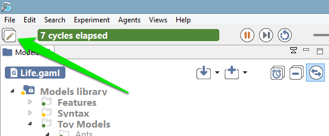

# Experiments User Interface

As soon as an experiment is [launched](https://github.com/gama-platform/gama/wiki/Content\References\PlatformDocumentation\RunningExperiments\LaunchingExperiments.md), the modeler is facing a new environment (with different menus and views) called the _Simulation Perspective_). The _Navigator_ is still opened in this perspective, though, and it is still possible to [edit models](https://github.com/gama-platform/gama/wiki/Content\References\PlatformDocumentation\EditingModels.md) in it, but it is considered as good practice to use each perspective for what is has been designed for. Switching perspectives is easy. The small button in the top-left corner of the window allows to switch back and forth the two perspectives.

The actual contents of the simulation perspective will depend on the experiment being run and the [outputs it defines](G__DefiningOutputs). The next sections will present the most common ones ([inspectors, monitors](https://github.com/gama-platform/gama/wiki/Content\References\PlatformDocumentation\RunningExperiments\InspectorsAndMonitors.md) and [displays](G__Display)), as well as the views that are not defined in outputs, like the [Parameters](https://github.com/gama-platform/gama/wiki/Content\References\PlatformDocumentation\RunningExperiments\ParametersView.md) or [Errors view](https://github.com/gama-platform/gama/wiki/Content\References\PlatformDocumentation\RunningExperiments\ErrorsView.md). An overview of the [menus and commands](https://github.com/gama-platform/gama/wiki/Content\References\PlatformDocumentation\RunningExperiments\MenusAndCommands.md) specific to the simulation perspective is also available.