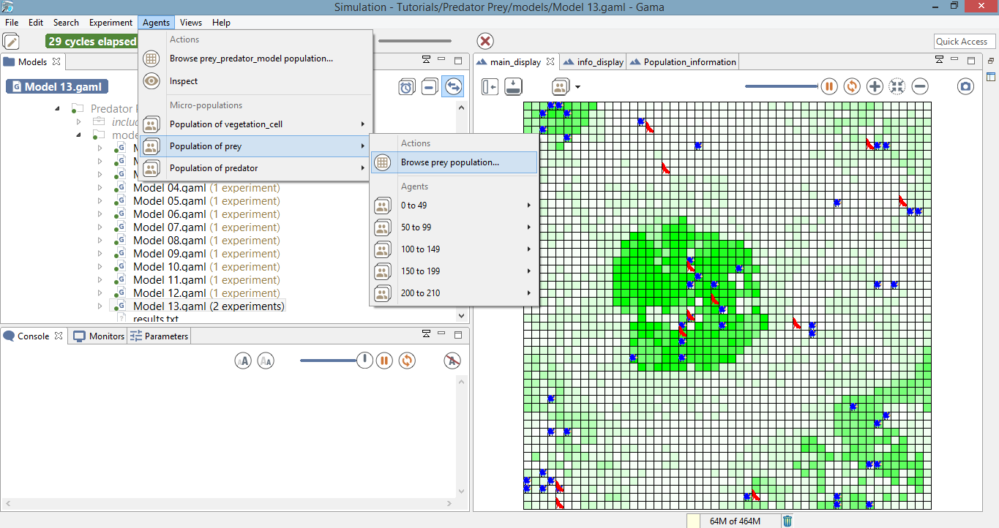
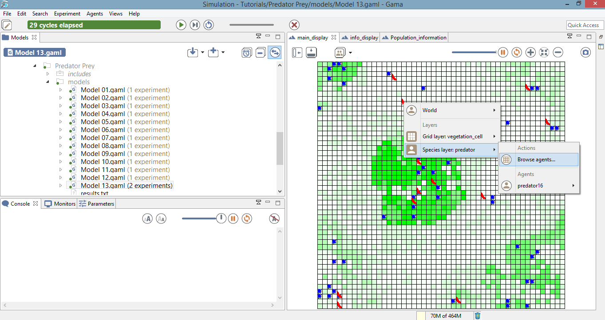
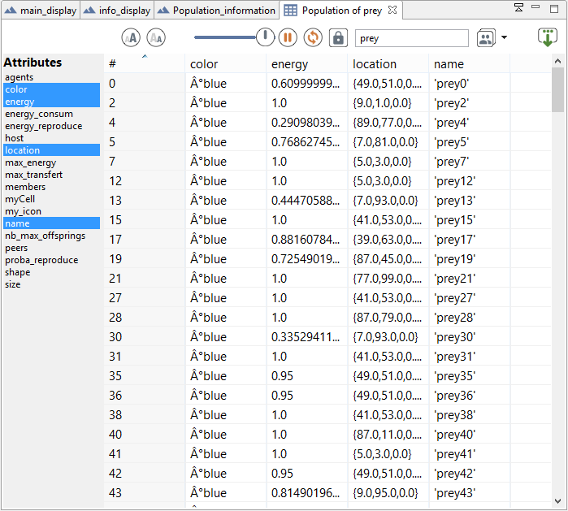
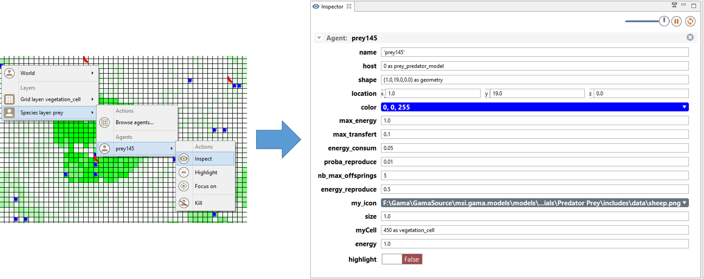
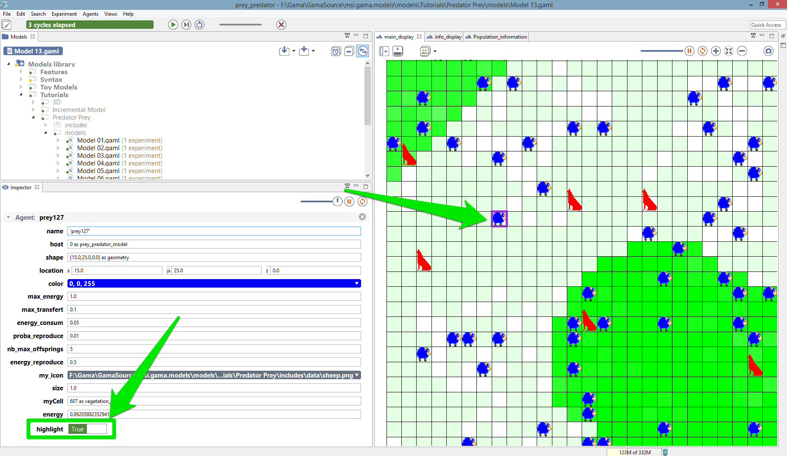
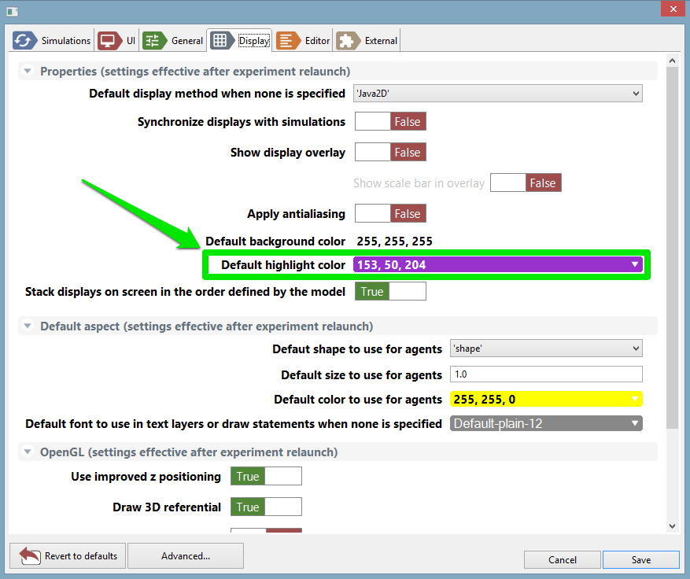
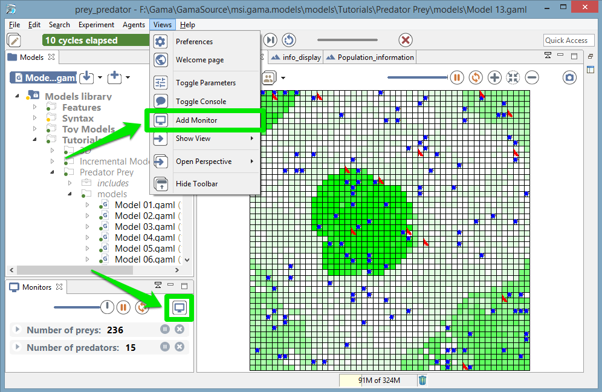
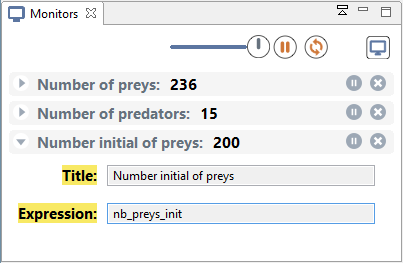

# Inspectors and monitors

GAMA offers some tools to obtain informations about one or several agents. There are two kinds of tools :
* agent browser
* agent inspector

GAMA offers as well a tool to get the value of a specific expression: monitors.

## Table of contents 

* [Inspectors and monitors](#inspectors-and-monitors)
	* [Agent Browser](#agent-browser)
	* [Agent Inspector](#agent-inspector)
	* [Monitor](#monitor)

## Agent Browser
The species browser provides informations about all or a selection of agents of a species.

The agent browser is available through the **Agents** menu or by right clicking on a display (screenshots from the ).

It displays in a table all the values of the agent variables of the considered species; each line corresponding to an agent. The list of attributes is displayed on the left side of the view, and you can select the attributes you want to be displayed, simply by clicking on it (Ctrl + Click for multi-selection).

By clicking on the right mouse button on a line, it is possible to do some action for the corresponding agent.

## Agent Inspector
The agent inspector provides information about one specific agent. It also allows to change the values of its variables during the simulation. The agent inspector is available from the **Agents** menu, by right\_clicking on a display, in the species inspector or when inspecting another agent.

It is possible to «highlight» the selected agent.

To change the color of the highlighted agent, go to Preferences/Display.

## Monitor
Monitors allow to follow the value of a GAML expression. For instance the following monitor allow to follow the number of infected people agents during the simulation. The monitor is updated at each simulation step.

It is possible to define a monitor inside a model (see [this page](G__DefiningMonitorsAndInspectors)). It is also possible to define a monitor through the graphical interface.

To define a monitor, first choose **Add Monitor** in the **Views** menu (or by clicking on the icon in the Monitor view), then define the display legend and the expression to monitor.

In the following example, we defined a monitor with the legend "Number initial of preys" and that has for value the global variable "nb_preys_init".

The expression should be written with the GAML language. See [this page](G__GamlReference) for more details about the GAML language.
