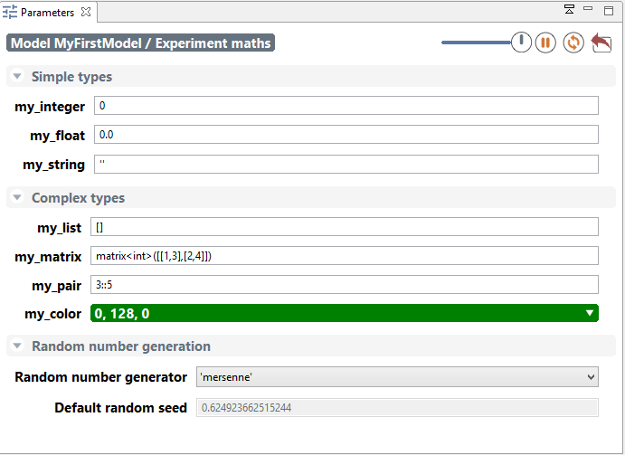

# Parameters View


In the case of an [experiment](G__DefiningExperiments), the modeler can [define the parameters](https://github.com/gama-platform/gama/wiki/Content\Tutorials\LearnGAMLStepByStep\DefiningGUIExperiment\DefiningParameters.md) he wants to be able to modify to explore the simulation, and thus the ones he wants to be able to display and alter in the GUI interface.

**It important to notice that all modification made in the parameters are used for simulation reload only. Creation of a new simulation from the model will erase the modifications.**


## Table of contents 

* [Parameters View](#parameters-view)
	* [Built-in parameters](#built-in-parameters)
	* [Parameters View](#parameters-view)
	* [Modification of parameters values](#modification-of-parameters-values)


## Built-in parameters
Every [GUI experiment](G__DefiningExperiments) displays a pane named "Parameters" containing at least two built-in parameters related to the random generator:
  * the Random Number Generator, with a choice between 4 RNG implementations,
  * the Random Seed


## Parameters View
The modeler can [define himself parameters](https://github.com/gama-platform/gama/wiki/Content\Tutorials\LearnGAMLStepByStep\DefiningGUIExperiment\DefiningParameters.md) that can be displayed in the GUI and that are sorted by categories. Note that the interface will depend on the data type of the parameter: for example, for integer or float parameters, a simple text box will be displayed whereas a color selector will be available for color parameters. The parameters value displayed are the initial value provided to the variables associated to the parameters in the model.



The above parameters view is generated from the following code:
```
global
{
	int i;
	float f;
	string s;
	list l;
	matrix m;
	pair p;
	rgb c;
}

experiment maths type: gui {
    parameter "my_integer" var: i <- 0 category:"Simple types";
    parameter "my_float" var: f <- 0.0 category:"Simple types";
    parameter "my_string" var: s <- "" category:"Simple types";

    parameter "my_list" var: l <- [] category:"Complex types";
    parameter "my_matrix" var: m <- matrix([[1,2],[3,4]]) category:"Complex types";
    parameter "my_pair" var: p <- 3::5 category:"Complex types";
    parameter "my_color" var: c <- #green category:"Complex types";

    output {}
}
```
Click on Edit button in case of list or map parameters or the color or matrix will open an additional window to modify the parameter value.


## Modification of parameters values

The modeler can modify the parameters value. In order that the modification to be taken into account in the simulation, he has to reload the simulation.
If he wants to come back to the initial value of parameters, he can click on the top-right curved arrow of the parameters view.