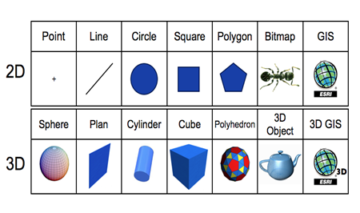

# Defining Aspects (Under Construction)
<font color='red'><i>todo</i>:<br>
<ul><li>Explain that aspect can contain any other statements (not just draw) and give an example of a complex aspect<br>
</li><li>begin the examples progressively (i.e. with simple, evident aspects)<br>
</li><li>link with °pixel somewhere (and explain its meaning in the context of an aspect)<br>
</font>
<hr />
The aspect statement allows to define how the agents will be displayed. It is possible to define different displays (i.e. different aspect sections) for a same species. In this context, the user will be able to change the display drawn during the simulation execution.</li></ul>


## Table of contents 

* [Defining Aspects (Under Construction)](#defining-aspects-under-construction)
	* [Draw Command](#draw-command)
	* [Shape Primitive](#shape-primitive)


## Draw Command

The command **draw** allows to draw a geometry (line, circle, square, agent geometry...), a icon or a text:
* geometry: any arbitrary geometry, that will only be affected by the color facet.
* text: string, the text to draw.
* image: file, optional, path of the icon to draw (JPEG, PNG, GIF).

Several facets can be added:
* **color**: rgb, optional, the color to use to display the text/icon/geometry.
* **size**: float, size of the text/icon (not use in the context of the drawing of a geometry).
* **at**: point, location where the shape/text/icon is drawn.
* **rotate**: int, orientation of the shape/text/icon.
* **depth**: float, optional (only works if the type of the display is opengl). Add a depth to the geometry previously defined (a point becomes a sphere, a line becomes a plan, a circle becomes a cylinder, a square becomes a cube,a polygon becomes a polyhedron with depth equal to the z value). Note: This only works if the agent geometry is not a point.
* **border**: rgb, optional, the color to use to display the envelope of the geometry.

For example, the following model defines three aspects for the agent: one named "info", another named "icon" and the last one named "default".

```
aspect info {
    draw square(2) at: location rotate: heading;
    draw square(2) rotated_by heading;
    draw line([location, destination + (destination - location)]) to: color:rgb("white") ;
    draw circle(4) at: location empty:true color:rgb("white") ;
    draw heading color: rgb("white")  size:1;
    draw state color: rgb("white")  size:1 at:my location + {1,1};
}
			
aspect icon {
    draw file_icon at: location size: 2 rotate: heading;
}

aspect default {
    draw square(2) at: location empty: !hasFood color:rgb("yellow") rotate: heading;
}

```


## Shape Primitive
GAMA provides several shape primitives to display agents.




Examples of GAMA Shape Primitives with on [opengl display](Gama3D16):
```
draw circle(10) color: rgb('red') at: {0,0,0};
draw cylinder(10,5) color: rgb('red') at: {25,0,0};  
draw sphere(10) color: rgb('red') at: {50,0,0}; 
draw square(20) color: rgb('blue') at: {0,25,0};
draw cube(20) color: rgb('blue') at: {25,25,0};
draw rectangle(20, 15) color: rgb('green') at: {0,50,0}; 
draw rectangle({20, 15}) color: rgb('green') at: {25,50,0}; 
draw box({20, 15 , 10}) color: rgb('green') at: {50,50,0};		
draw polygon ([{0,0},{10,0},{10,10},{15,15},{10,15},{5,10},{0,0}]) color: rgb('yellow') at: {0,75,0};
draw polyhedron ([{0,0},{10,0},{10,10},{15,15},{10,15},{5,10},{0,0}],10) color: rgb('yellow') at: {25,75,0};
draw line ([{0,0},{10,10}]) at: {0,100,0};		
draw plan ([{0,0},{10,10}],10) at: {25,100,0};
draw polyline ([{0,0},{5,5},{10,0}]) at: {0,125,0};
draw polyplan ([{0,0},{5,5},{10,0}],10) at: {25,125,0};
```