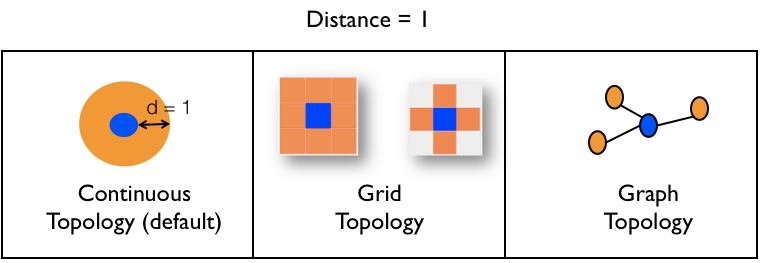

# Defining Species

Species are key elements of GAMA models (see [here](G__KeyConcepts)) A species is an archetype of agents and specifies their properties. A model is itself a species that can contain any number of species.


## Table of contents 

* [Defining Species](#defining-species)
	* [Species Declaration](#species-declaration)
	* [Schedul Description](#schedul-description)
	* [Topology Description](#topology-description)
	* [Types of Species](#types-of-species)


## Species Declaration
The simplest way to declare a regular species is the following:

```
species a_name {
  
}
```

for example:

```
species foo {} //it is also possible to directly write: species foo;
```

The agents that will belong to this species will only be provided with some built-in attributes and actions, a basic behavioral structure and nothing more. These elements are directly inherited from the default parent species called [`agent`](G__AgentBuiltInSpecies).  [this page](G__RegularSpecies) to specify a different parent for the species.

A species can contain several elements:
* [Attributes](G__DefiningAttributes): define the state of the agents.
* [Actions](G__DefiningActions): define a capacity of the agents. An action is a block of instructions that are executed when the action is called.
* [Inits and Reflexes](G__DefiningBehaviors): defines the default behavior of the agents. Both statements contain instructions that are executed, respectively, once when the agent is created for `init` statements, and at each simulation step (according to an optional condition) for `reflex` statements.
* [Aspects](G__DefiningAspects): define how the agents can be displayed.
* [Equations](G__DefiningEquations): define a set of differential equations that can be integrated when necessary.
* [Micro-species](G__MultiLevel): nested species can be described inside a species. See [here](G__MultiLevel) for more details on the relationships between macro- and micro-species.

Note that all the elements previously defined are optional. It is totally possible to define an empty species without any attributes, actions, reflexes, aspects, equations or micro-species like in the example above.

In addition to the regular inheritance mechanisms, modelers can attach skills and control architectures to species, which will provide their agents with new attributes, actions and behaviors. See [here](G__SkillsAndControl) for how to define these capabilities.

Finally, some specific features concerning the interaction of users with agents can be added to any species. It is for example possible to define an action that will be executed by the user. See [here](G__DefiningUserCommands) for more details.


## Schedul Description

The modeler can specify the scheduling information of a species. This scheduling information is composed of the execution frequency and the list of agent to be scheduled.

* the execution frequency is the frequency which agents of the species are considered to be scheduled.
* "the list of agent to be scheduled" is an expression returning a list of agent dynamically evaluated at runtime.

```
species foo frequency: 2 schedules: foo where (each.energy > 50)  {
    float energy <- rnd (100) min: 0 max: 100 value: energy - 0.001;
  ...
}
```

* frequency: we schedule the agents declared in `schedules:` every 2 simulation steps (or all the agents of the species if `schedules:` is not defined).
* schedules: an expression that returns the list of agent to be scheduled, in that case all the foo agents having a level of energy greater than 50. Two things worth to be mentioned regarding this facet:
    1. The list of agents can contain any type of agents, not necessarily agents of the species, making it possible to define [custom scheduling rules](G__RuntimeConcepts#Scheduling_of_Agents).
    1. The contents of this facet **is not inherited*y children species.


## Topology Description

The topology describes the spatial organization of the species. This imposes constraint on the movement and perception (neighborhood) of the species' agents. GAMA supports three types of topology: continuous, grid and graph.



```
species foo topology: (square (10)) at_location {50, 50}  {
  ...
}
```

Topology of the "foo" species is a square of 10 meters each side at location {50, 50}.

By default, a species has a continuous topology. However, it is possible to define species with a specific grid or graph topology (see the next Section).


## Types of Species

Several types of species exist in GAMA:
* [global species](G__GlobalSpecies): The global species defines the model, i.e. the attributes, actions, behaviors and micro-species that describe the world agent.
* [regular species](G__RegularSpecies): species of agents with a continuous topology by default.
* [grid species](G__GridSpecies): species of agents with a grid topology.
* [graph species](G__GraphSpes): species of agents with a graph topology.
* [mirror species](G__MirrorSpec): species of agents that mirror the population of another species.
* [multi-level species](G__MultiLevel): species of agents that contains other agents.