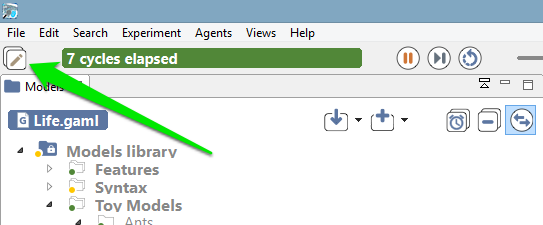

# Experiments User Interface

---

As soon as an experiment is [launched](G__LaunchingExperiments.md), the modeler is facing a new environment (with different menus and views) called the _Simulation Perspective_). The _Navigator_ is still opened in this perspective, though, and it is still possible to [edit models](G__EditingModels.md) in it, but it is considered as good practice to use each perspective for what is has been designed for. Switching perspectives is easy. The small button in the top-left corner of the window, next to the [preferences](G__Preferences.md) button, allows to switch back and forth the two perspectives.

 
  
 

The actual contents of the simulation perspective will depend on the experiment being run and the [outputs it defines](G__DefiningOutputs.md). The next sections will present the most common ones ([inspectors, monitors](G__InspectorsAndMonitors.md) and [displays](G__Display.md)), as well as the views that are not defined in outputs, like the [Parameters](G__ParametersView.md) or [Errors view](G__ErrorsView.md). An overview of the [menus and commands](G__MenusAndCommands.md) specific to the simulation perspective is also available.