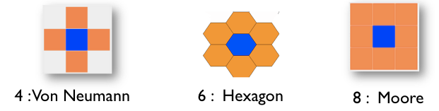

# Grid Species
<font color='red'><i>todo</i>:<br>
<ul><li>constraints: grid are only micro-species of the world<br>
</li><li>link with matrix<br>
</li><li>maybe a word about scheduling ?<br>
</font>
<hr />
A grid is a particular species of agents. Indeed, a grid is a set of agents that share a grid topology. As other agents, a grid species can have <a href='G__DefiningAttributes'>attributes</a>, <a href='G__DefiningActions'>attributes</a>, <a href='G__DefiningBehaviors'>behaviors</a>, <a href='G__DefiningAspects'>aspects</a>, <a href='G__DefiningEquations'>equations</a> and  <a href='G__MultiLevel'>micro-species</a>.</li></ul>

However, contrary to regular species, grid agents are created automatically at the beginning of the simulation. It is thus not necessary to use the create statement to create them.

Moreover, in addition to classic built-in variables, grid a provided with a set of additional built-in variables

## Table of contents 

* [Grid Species](#grid-species)
	* [Declaration](#declaration)
		* [basis](#basis)
		* [optimization facets](#optimization-facets)
			* [use_regular_agents](#useregularagents)
			* [use_individual_shapes](#useindividualshapes)
			* [use_neighbours_cache](#useneighbourscache)
	* [Built-in variables](#built-in-variables)
		* [grid_x](#gridx)
		* [grid_y](#gridy)
		* [agents](#agents)
		* [color](#color)
		* [grid_value](#gridvalue)
	* [Access to cells](#access-to-cells)
	* [Display grid](#display-grid)


## Declaration
### basis
There are several ways to declare a grid species:
  * by defining the number of rows and columns:
```
   grid grid_name width: nb_cols height: nb_rows neighbors: 4/6/8 {
      ...
   }
```
  * by using an _asc_ grid file:
```
   grid file:file("../includes/dem.asc") neighbors: 4/6/8 {
      ...
   }
```
With:
* width : number of cells along x-axis (number of columns)
* height : number of cells along y-axis (number of rows)
* file: file used to initialized the grid
* neighbours : neighborhood type (4 - Von Neumann, 6 - hexagon or 8 - Moore)



If a file is used to declare the grid, the number of rows and columns is automatically computed from the file. In the same way, the value of the cell read in the file is stored in the **grid\_value** built-in variable.

NB : the dimensions of the grid (in ```#m```, ```#cm``` etc...) are defined in the [global species](G__GlobalSpecies).

### optimization facets
A grid can be provided with specific facets that allows to optimized the computation time and the memory space.

#### use\_regular\_agents
```
      use_regular_agents: true/false,
```
If **false**, the grid will be composed of "minimal" agents, that uses less computer memory, but have some limitations: they cannot inherit from "normal" species, they cannot have sub-populations, their name is fixed and cannot be changed,...
By default, this facet is set to **true** when declaring a grid without this facet.

#### use\_individual\_shapes
```
      use_individual_shapes: true/false,
```
If **false**, then just one geometry is used for all agents (that can be translated). The goal is limit the memory used by the geometries.
By default, this facet is set to **true** when declaring a grid without this facet.


#### use\_neighbours\_cache
```
      use_neighbours_cache: true/false,
```
If **false**, no neighbours computation result are stored in the cache.
By default, this facet is set to **true** when declaring a grid without this facet.


## Built-in variables
Grid agents are provides with several specific built-in variables.

### grid\_x
This variable stores the column index of a cell.
```
   grid cell width: 10 height: 10 neighbors: 4 {
        init {
             write "my column index is:" + grid_x;
        }
   }
```

### grid\_y
This variable stores the row index of a cell.
```
   grid cell width: 10 height: 10 neighbors: 4 {
        init {
             write "my row index is:" + grid_y;
        }
   }
```
### agents
return the set of agents located inside the cell. Note the use of this variable is deprecated.
It is preferable to use the **inside** operator:

```
 grid cell width: 10 height: 10 neighbors: 4 { 
        list<bug> bugs_inside -> {bug inside self};
   }
```

### color
The **color** built-in variable is used by the optimized grid display. Indeed, it is possible to use for grid agents an optimized aspect by using in a display the **grid** keyword. In this case, the grid will be displayed using the color defined by the **color** variable. The border of the cells can be displayed with a specific color by using the **lines** facet.
Here an example of the display of a grid species named **cell** with black border.

```
experiment main_xp type: gui{
	output {
		display map {
			grid cell lines: rgb("black") ;
		}
	}
}
```

### grid\_value
The **grid\_value** built-in variable is used when initializing a grid from grid file (see later). It is also used for the 3D representation of [DEM](http://code.google.com/p/gama-platform/wiki/DEM).


## Access to cells
there are several ways to access to a specific cell:
  * by a location: by casting a location to a cell (the unity (```#m```, ```#cm```, etc...) is defined when you choose your environment size, in the [global species](G__GlobalSpecies).
```
   global {
         init {
             write "cell at {57.5, 45} :" + cell({57.5, 45});
         }
   }

   grid cell width: 10 height: 10 neighbors: 4 {
   }
```
  * by the row and column indexes: like matrix, it is possible to directly access to a cell from its indexes
```
   global {
         init {
             write "cell [20,10] :" + cell[20,20];
         }
   }
   grid cell width: 10 height: 10 neighbors: 4 {
   }
```

## Display Grid
You can easily display your grid in your experiment as followed :
```
experiment MyExperiment type: gui {
    output {
        display MyDisplay type: opengl {
            grid MyGrid;
        }
    }
}
```
The grid will be displayed with the color you defined before.
An other way to display a grid will be to define an aspect in your grid agent (the same way as for a [regular species](G__RegularSpecies)), and define your grid as a regular species then in your experiment, choosing your aspect : 
```
grid MyGrid {
    aspect firstAspect {
        draw square(1);
    }
    aspect secondAspect {
        draw circle(1);
    }
}

experiment MyExperiment type: gui {
    output {
        display MyDisplay type: opengl {
            species MyGrid aspect:firstAspect;
        }
    }
}
```
Beware : don't use this second display when you have large grids : it's much slower.