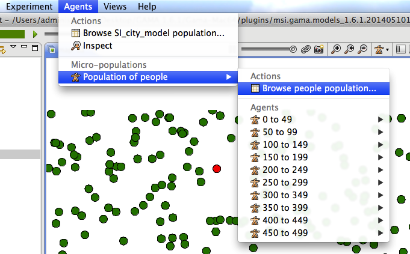
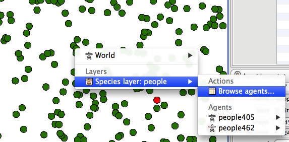
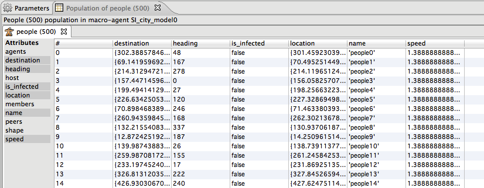
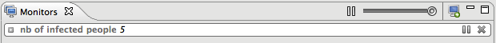
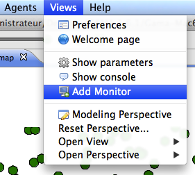
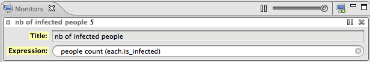

# Inspectors and monitors

---

GAMA offers some tools to obtain informations about one or several agents. There are two kinds of tools :
  * agent browser
  * agent inspector

GAMA offers as well a tool to get the value of a specific expression: monitors.

 

---

## Agent Browser
The species browser provides informations about all or a selection of agents of a species.

The agent browser is available through the **Agents** menu or by right clicking on a by right\_clicking on a display.

    
 

    
 

It displays in a table all the values of the agent variables of the considered species; each line corresponding to an agent.

    
 

By clicking on the right mouse button on a line, it is possible to highlight or to inspect the corresponding agent.

 

---

## Agent Inspector
The agent inspector provides information about one specific agent. It also allows to change the values of its variables during the simulation. The agent inspector is available from the **Agents** menu, by right\_clicking on a display, in the species inspector or when inspecting another agent.

It is possible to «highlight» the selected agent.

 

---

## Monitor
Monitors allow to follow the value of a GAML expression. For instance the following monitor allow to follow the number of infected people agents during the simulation. The monitor is updated at each simulation step.

    
 

It is possible to define a monitor inside a model (see [this page](G__DefiningMonitorsAndInspectors)). It is also possible to define a monitor through the graphical interface.

To define a monitor, first choose **Add Monitor** in the **Views** menu. then define the display legend and the expression to monitor.
    
 

In the following example, we defined a monitor with the legend "nb of infected people" and that has for value the number of infected people.
    
 

The expression should be written with the GAML language. See [this page](G__GamlReference) for more details about the GAML language.