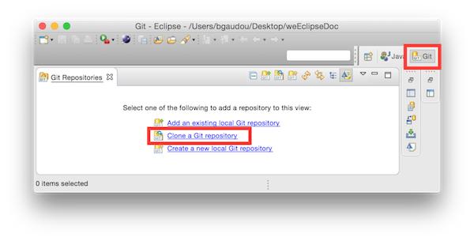
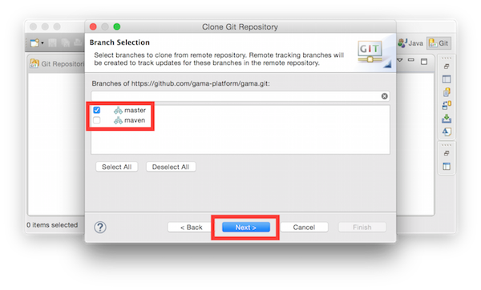
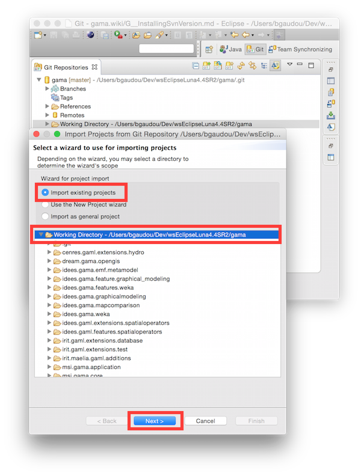

# Installing the GIT version

This installation procedure has been tested on MacOS X (10.9 to 10.11), Windows (8 and 10) and Ubuntu 15.04 (Vivid). On MacOS X 10.10 (Yosemite) or MacOS X 10.11 (El Capitan), please have a look here: [install Java on MacOS X](G__Installation) for details about the Java version to use. 

**Important note: the current Git version is no more compatible with the GAMA 1.6.1 release.**
  * If you plan to create plugin that should be compatible with the release, please download the GAMA code source at revision r11988 (on Google Code) and [Eclipse following this procedure](G__InstallingSvnOldVersions)

## Download Eclipse

Download the "Eclipse IDE for Java and DSL Developers" version of Mars SR1 from: `http://www.eclipse.org/downloads/packages/eclipse-ide-java-and-dsl-developers/mars1`

Unpack it anywhere and run it. At the first run, Eclispe will ask to choose a new workspace
  * A workspace is a folder in which Eclipse stores all your projects.

## Install GAMA

The GAMA source code should now be downloaded from the GIT repository (hosted by GitHub). A local clone of the remote repository will be created ; then the projects will be (logically) imported into the Eclipse workspace.

1. Open the Git perspective:
  * Windows > Open Perspective > Other...
  * Choose `Git`

2. Click on "Clone a Git repository"

  * In **Source Git repository** window: 
    * Fill in the URI label with: `https://github.com/gama-platform/gama.git`
    * Other fields will be automatically filled in.
    
  * In **Branch Selection** windows, 
    * check the master branch 
    * Next

  * In **Local Destination** windows,
    * Choose a Directory (where the source files will be downloaded).
    * Everything else should be unchecked 
    * Finish

This can take a while...

### Import projects into workspace
You have now to import projects into the workspace (notice that the folders downloaded during the clone will neither be copied nor moved).

1. In the **Git perspective** and the **Git Repositories** view, Right-Click on "Working Directory" inside the `gama` repository, and choose "Import projects"

  * In the **Select a wizard to use for importing projects** window:
    * "Import existing projects" should be checked
    * "Working Directory" should be selected
    
  * In **Import Projects** window:
    * **Uncheck « Search for nested project »**
    * Check the projects you want to import
    * Finish

2. Go back to the Java perspective
3. Clean project (Project menu > Clean ...)

### Run GAMA
1. In the `msi.gama.application` plugin, open the `gama1.7.Eclipse3_8_2.product` file
2. Go to "Dependencies" tab and click on "Add required"
3. Click on Synchronize
4. Click on Launch an Eclipse Application

###GIT Tutorials
For those who want learn more about Git and Egit, please consult the following tutorials/papers

1. EGIT/User Guide http://wiki.eclipse.org/EGit/User_Guide
2. Git version control with Eclipse (EGIT) - Tutorial http://www.vogella.com/tutorials/EclipseGit/article.html
3. 10 things I hate about Git http://stevebennett.me/2012/02/24/10-things-i-hate-about-git/
4. Learn Git and GitHub Tutorial https://www.youtube.com/playlist?list=PL1F56EA413018EEE1