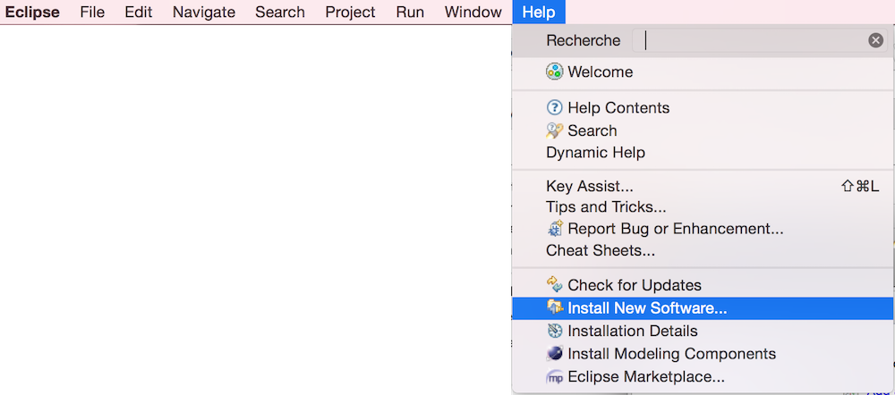
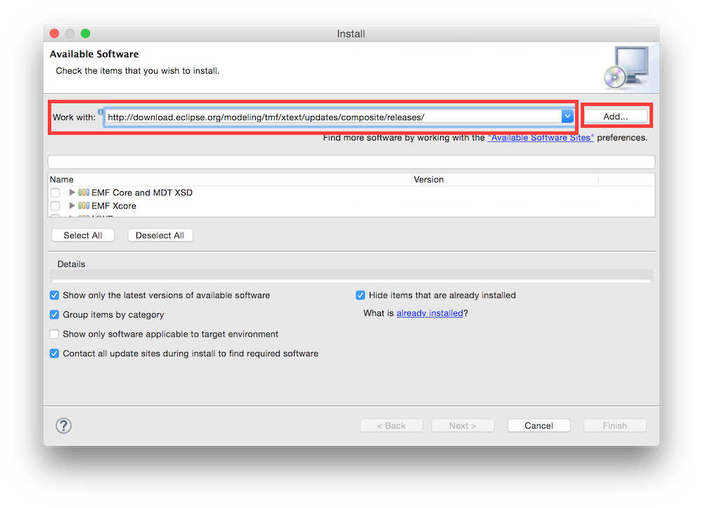
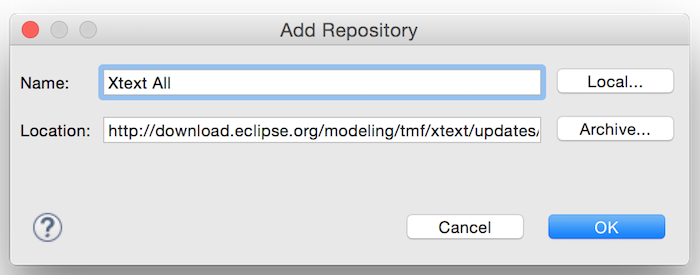
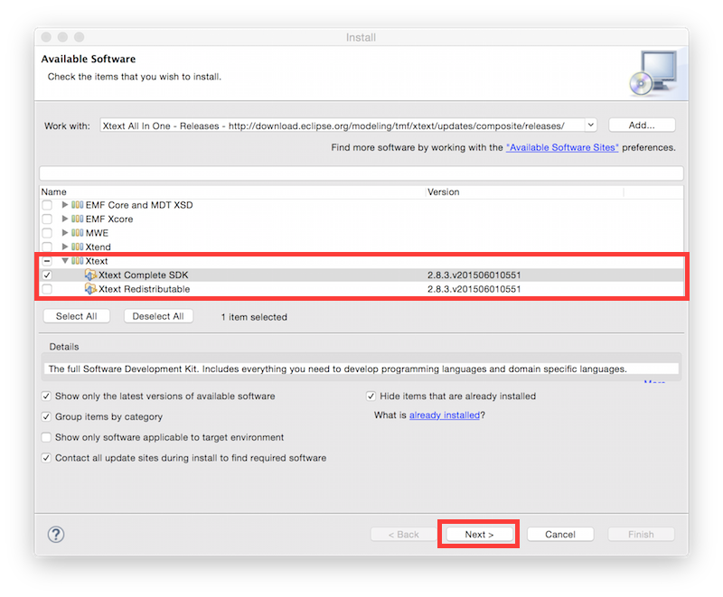
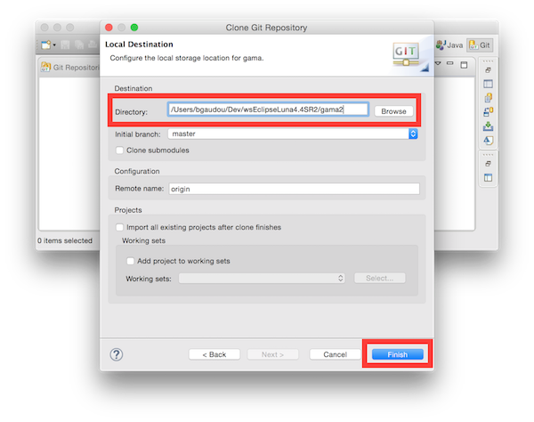

# Installing the GIT version

This installation procedure has been tested on MacOS X 10.10 (Yosemite) and Windows 8. On MacOS x 10.10 (Yosemite), please have a look here: [install Java on Yosemite](G__Installation) for details about the Java version to use. 

**Notice that GAMA is in a migration phase from Eclipse 3.8.2 to Eclipe Luna 4.4.2, and from SVN to Git. Other previous Eclipse versions are not supported anymore**.

**Important note: the current Git version is no more compatible with the GAMA 1.6.1 release.**
  * If you plan to create plugin that should be compatible with the release, please download the GAMA code source at revision r11988 (on Google Code) and [Eclipse following this procedure](G__InstallingSvnOldVersions)

## Summary
1. Download the Eclipse Modeling Tools version of Luna SR2 from: `https://eclipse.org/downloads/packages/eclipse-modeling-tools/lunasr2`
2. In Eclipse, install Xtext (in Install new softwares with `http://download.eclipse.org/modeling/tmf/xtext/updates/composite/releases/`). The version should be `Xtext Complete SDK	2.8.2.v201504100559` 
3. Clone the GitHub repository from `https://github.com/gama-platform/gama.git`
4. Import all the project.

## Detailed Instructions for Eclipse 4.4.2 (Luna SR2)

### Get and configure Eclipse Luna
1. Download the Eclipse Modeling Tools version of Luna SR2 from:
  * `https://eclipse.org/downloads/packages/eclipse-modeling-tools/lunasr2`
2. Unpack it anywhere and run it
3. At the first run, Eclispe will ask to choose a new workspace
  * A workspace is a folder in which Eclipse stores all your projects.
4. Install the required plugins. 
  * Go to "Help" -> "Install new software"

  * In "work with", write "http://download.eclipse.org/modeling/tmf/xtext/updates/composite/releases/", click on "Add" and choose a name (e.g. Xtext).

    * Choose "Xtext" and the following version:  `Xtext Complete SDK	2.8.2.v201504100559`

    * Accept the licence and install.
    * Restart Eclipse

### Get code source from GitHub
The GAMA source code should now be downloaded from the GIT repository (hosted by GitHub). A local clone of the remote repository will be created ; then the projects will be (logically) imported into the Eclipse workspace.

1. Open the Git perspective:
  * Windows > Open Perspective > Other...
  * Choose `Git`

2. Click on "Clone a Git repository"

  * In **Source Git repository** window: 
    * Fill in the URI label with: `https://github.com/gama-platform/gama.git`
    * Other fields will be automatically filled in.
    
  * In **Branch Selection** windows, 
    * check the master branch 
    * Next

  * In **Local Destination** windows,
    * Choose a Directory (where the source files will be downloaded).
    * Everything else should be unchecked 
    * Finish

### Import projects into workspace
You have now to import projects into the workspace (notice that the folders downloaded during the clone will neither be copied nor moved).
1. In the **Git perspective**, Right-Click on "Working Directory", and choose "Import projects"
  * Select a wizard to use for importing projects:
    * "Import existing projects" should be  checked
    * "Working Directory" should be selected
    * Next
  * In Import Projects:
    * Uncheck « Search for nested project »
    * Check the projects you want to import
    * Finish

Go back to the Java perspective
