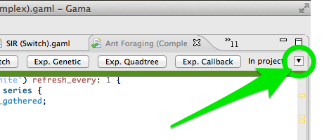
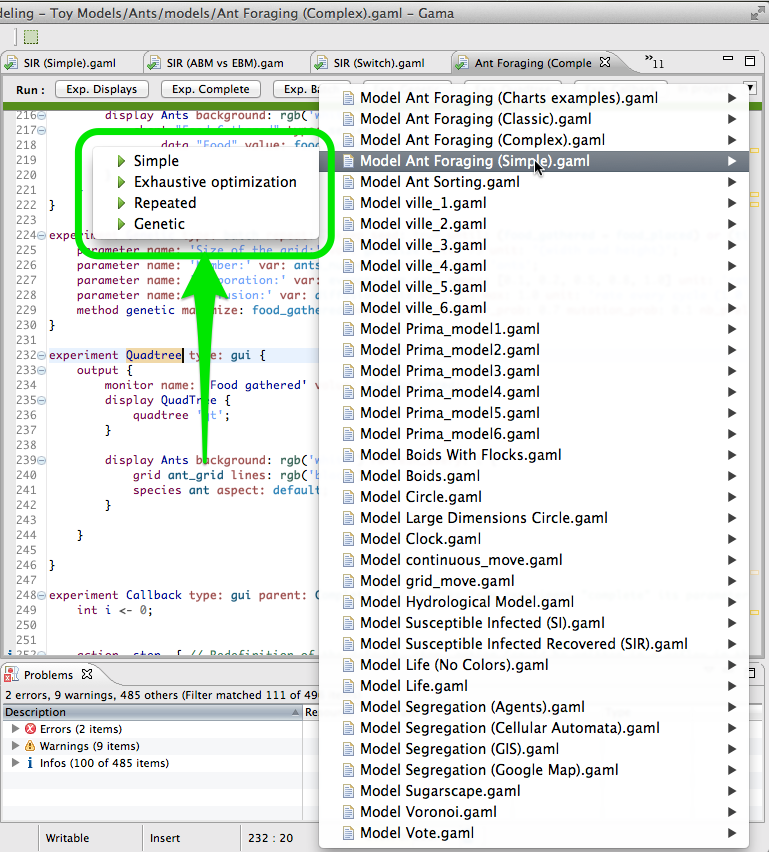

# Launching Experiments from the User Interface

GAMA supports multiple ways of launching experiments from within the Modeling Perspective, in editors or in the [navigator](G__NavigatingWorkspace).

## Table of contents 

* [Launching Experiments from the User Interface](#launching-experiments-from-the-user-interface)
	* [From an Editor](#from-an-editor)
	* [From the Navigator](#from-the-navigator)
	* [Running Experiments Automatically](#running-experiments-automatically)

## From an Editor
As already mentioned on [this page](G__GamlEditor), GAML editors will provide the easiest way to launch experiments. Whenever a model that contains the definition of experiments is validated, these experiments will appear as distinct buttons, in the order in which they are defined in the file, in the header ribbon above the text. Simply clicking one of these buttons launches the corresponding experiment.

In case the currently edited file  does not define any experiment, but if other files _in the same project_ define some, it is possible to access them directly from the editor using the small "In project:" drop-down arrow on the upper-right corner of the editor.

This menu gives access to all the model files currently defined with experiments in the project and, for each, to its different experiments. Selecting one will have the same effect as clicking on the button in the editor of this file.

## From the Navigator
A same mechanism is implemented in the [Navigator](G__NavigatingWorkspace). Right-clicking on a category, on a project, on a sub-directory of a project, or on a model file will enable the command named "Run…" in the contextual menu. Depending on the object(s) being selected, this command will give you access to:

1. The experiments defined in the model file(s) selected
1. The experiments defined in the model file(s) present in the category(s), project(s) or folder(s) selected.

## Running Experiments Automatically
Once an experiment has been launched (unless it is run in [headless](G__Headless) mode, of course), it normally displays its views and waits from an input from the user, usually a click on the "Run" or "Step" buttons (see [here](G__MenusAndCommands)).

It is however possible to make experiments run directly once launched, without requiring any intervention from the user.  To install this feature, [open the preferences of GAMA](G__Preferences). On the first tab, simply check "Auto-run experiments when they are launched" (which is unchecked by default) and hit "OK" to dismiss the dialog. Next time you'll launch an experiment, it will run automatically (this option also applies to experiments launched from the command line).

