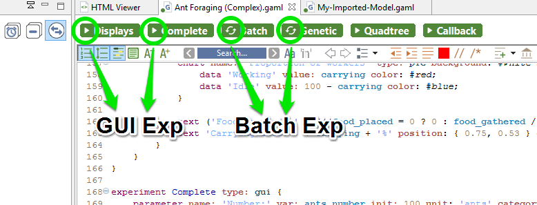

# Launching Experiments from the User Interface

GAMA supports multiple ways of launching experiments from within the Modeling Perspective, in editors or in the [navigator](G__NavigatingWorkspace).

## Table of contents 

* [Launching Experiments from the User Interface](#launching-experiments-from-the-user-interface)
	* [From an Editor](#from-an-editor)
	* [From the Navigator](#from-the-navigator)
	* [Running Experiments Automatically](#running-experiments-automatically)

## From an Editor
As already mentioned on [this page](G__GamlEditorGeneralities), GAML editors will provide the easiest way to launch experiments. Whenever a model that contains the definition of experiments is validated, these experiments will appear as distinct buttons, in the order in which they are defined in the file, in the header ribbon above the text. Simply clicking one of these buttons launches the corresponding experiment.

For each of those launching buttons, you can see 2 different pictograms, showing the type of experiment. An experiment can either be a [GUI Experiment](G__DefiningExperiments) or a [Batch Experiment](G__BatchExperiments).

## From the Navigator
You can also launch your experiments from the navigator, by expanding a model and double clicking on one of the experiments available (The number of experiments for each model is visible also in the navigator). As for the editor, the two types of experimentations (gui and batch) are differentiated by a pictogram.

## Running Experiments Automatically
Once an experiment has been launched (unless it is run in [headless](G__Headless) mode, of course), it normally displays its views and waits from an input from the user, usually a click on the "Run" or "Step" buttons (see [here](G__MenusAndCommands)).

It is however possible to make experiments run directly once launched, without requiring any intervention from the user.  To install this feature, [open the preferences of GAMA](G__Preferences). On the first tab, simply check "Auto-run experiments when they are launched" (which is unchecked by default) and hit "OK" to dismiss the dialog. Next time you'll launch an experiment, it will run automatically (this option also applies to experiments launched from the command line).

