# Navigating in the Workspace

All the models that you edit or run using GAMA are accessible from a central location: the _Navigator_, which is always on the left-hand side of the main window and cannot be closed. This view presents the models currently present in (or linked from) your **workspace**.

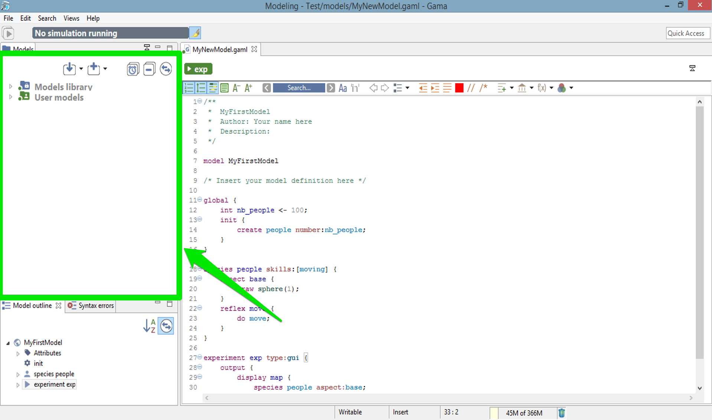

## Table of contents 

* [Navigating in the Workspace](#navigating-in-the-workspace)
	* [The Different Categories of Models](#the-different-categories-of-models)
		* [Models library](#models-library)
		* [User models](#user-models)
		* [Shared models](#shared-models)
	* [Moving Models Around](#moving-models-around)
	* [Closing and Deleting Projects](#closing-and-deleting-projects)

## The Different Categories of Models

In the _Navigator_, models are organized in three different categories: _Models library_, _Shared models_ and _User models_. This organization is purely logical and does not reflect where the models are actually stored in the workspace (or elsewhere). Whatever their actual location, model files need to be stored in **projects**, which may contain also other files (called _resources_) necessary for the models to function. A project may of course contain several model files, especially if they are importing each other, if they represent different models on the same topic, or if they share the same resources.

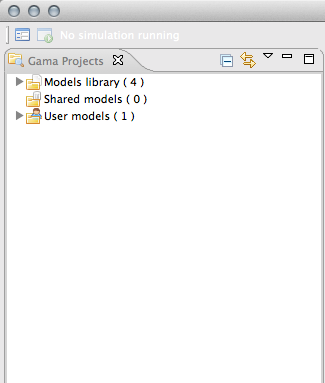

### Models library

This category represents the models that are shipped with each version of GAMA. They do not reside in the workspace, but are considered as _linked_ from it. This link is established every time a new workspace is created. Their actual location is within a plugin (msi.gama.models) of the GAMA application. This category contains four main projects in GAMA 1.6.1, which are further refined in folders and sub-folders that contain model files and resources.

<table>
<tr> <td>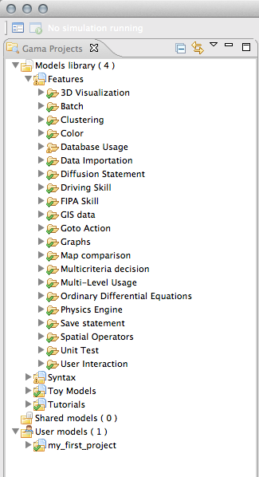 </td>
<td> </td></tr>
</table>

||[images/model_navigator/navigator_library_2_folders_expanded.png](images/model_navigator/navigator_library_2_folders_expanded.png)|

It may happen, in some occasions, that the library of models is not synchronized with the version of GAMA that uses your workspace. This is the case if you use different versions of GAMA to work with the same workspace. In that case, it is required that the library be manually updated. This can be done using the "Update library" item in the contextual menu.

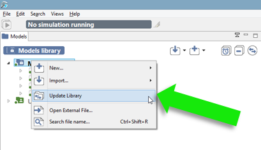

To look up for a particular model in the library, users can use the "Search for…" menu item. A search dialog is then displayed, which allows to look for models by their title (for example, models containing "GIS" in the example below).

<table>
<tr> <td>

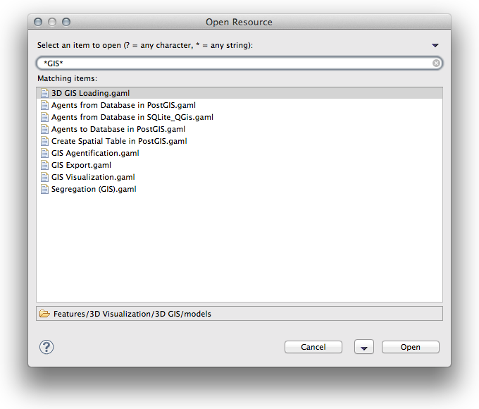</td></tr></table>

### User models

This category regroups all the projects that have been [created](G__GamlEditor) or [imported](G__ImportingModels) in the workspace by the user. Each project is actually a folder that resides in the folder of the workspace (so they can be easily located from within the filesystem). Any modification (addition, removal of files…) made to them in the filesystem (or using another application) is immediately reflected in the _Navigator_ and vice-versa.

Model files, although it is by no means mandatory, usually reside in a sub-folder of the project called "models".

 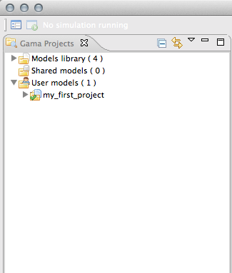 

### Shared models

Shared projects are projects that reside in the SVN repository of the site [gama-models.googlecode.com](https://gama-models.googlecode.com), which is intended to support GAMA users in easily sharing their models, as the access is built-in inside the platform. This category gives access to reading the models already contributed there (see [G\_\_SharingModels](G__SharingModels) to see how to contribute). It is initially empty, but invoking the "Update Shared Models" menu item will make GAMA retrieve the list of projects present on the site.

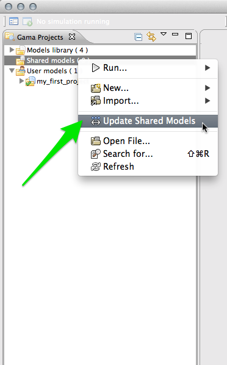

This retrieval is implemented to be as light as possible so as not to lock up the platform for a long time while the SVN client is reading up the information. It happens in the background, and only retrieves the description of models (when it is available).

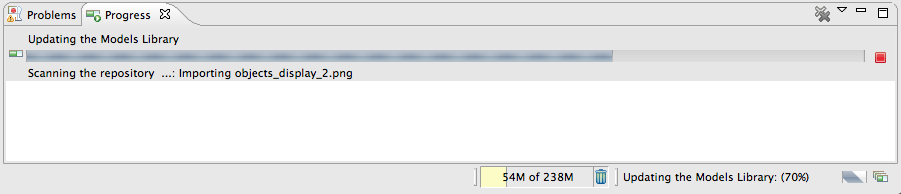

When the process is done, the navigator will display the html descriptions of the different projects found in the repository (the list below is indicative of the state of the SVN server as of May 2014, but the actual list of projects will undergo several changes as most of them are not compatible with the latest version of GAMA).

To retrieve a complete project, the user has to choose its corresponding description file and invoke "Checkout Project from Repository" from the contextual menu. After the download is over, the project will appear in the "User Models" category, sporting information on its revision number and location to distinguish it from the "regular" models already present in this category.

<table>
<tr> <td>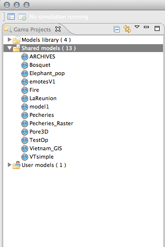 </td>
<td>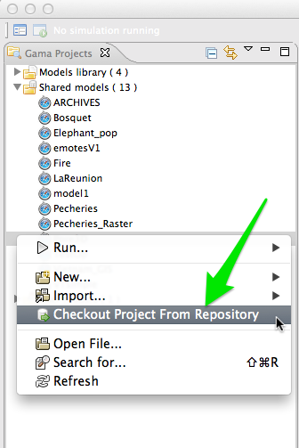 </td>
<td>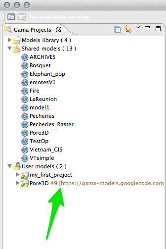 </td></tr>
</table>

If the user has a write access to the gama-models SVN repository, any modification he/she makes to the model can be committed back to the repository using the standard "Team…" submenu (see [G\_\_SharingModels](G__SharingModels)) and subsequently shared with all GAMA users.

## Moving Models Around
Model files, as well as resources, or even complete projects, can be moved around between the "Models Library" and "Users Models" categories, or within them, directly in the _Navigator_. Drag'n drop operations are supported, as well as copy and paste. For example, the model "Life.gaml", present in the "Models Library", can perfectly be copied and then pasted in a project in the "Users Model". This local copy in the workspace can then be further edited by the user without altering the original one.

<table>
<tr> <td>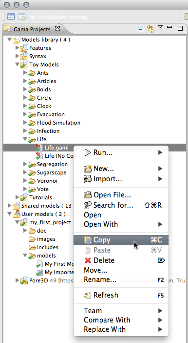 </td>
<td>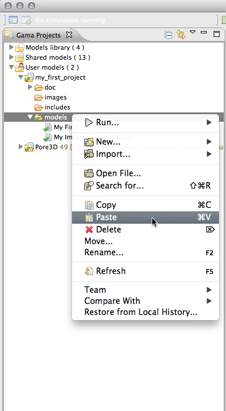 </td>
<td> </td></tr>
</table>

## Closing and Deleting Projects
Users can choose to get rid of old projects by either **closing** or **deleting** them. Closing a project means that it will still reside in the workspace (and be still visible, although a bit differently, in the _Navigator_) but its model(s) won't participate to the build process and won't be displayable until the project is opened again.

<table>
<tr> <td>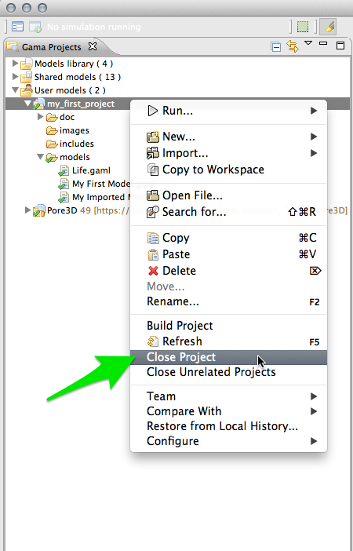 </td>
<td>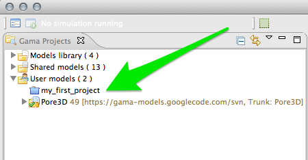 </td></tr>
</table>

**Deleting** a project must be invoked when the user wants this project to not appear in the workspace anymore (unless, that is, it is [imported](G__ImportingModels) again). Invoking this command will effectively make the workspace "forget" about this project, and this can be further doubled with a deletion of the projects resources and models from the filesystem.

<table>
<tr> <td>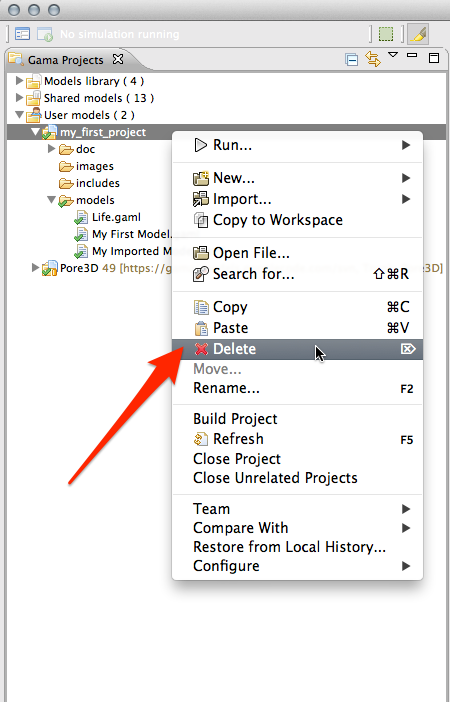 </td>
<td>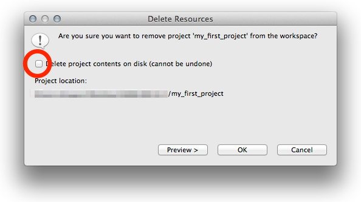 </td></tr>
</table>