# Sharing Models

Thanks to its native integration of the SVN versioning system, GAMA offers users the possibility to share their projects (provided they have access to a SVN repository), without any further need to install add-ons or plugins.

This section provides some basic information on how to share a project and manage it once it has been shared. For more specific documentation about SVN or other ways to use the built-in sharing facilities with other versioning systems, please refer to this [Eclipse documentation on SVN](http://www.eclipse.org/subversive/) and [this one on Git](http://projects.eclipse.org/projects/technology.egit) (go to [this page](G__InstallingPlugins) to learn how to install Git).

Note that projects [imported](G__ImportingModels) from a repository are automatically considered as "shared" between the workspace used by GAMA and the repository they have been imported from.

## Project Sharing
The initial sharing of contents between the GAMA platform and a remote repository can only be made at the level of a project. Once a project has been shared, however, its components are manageable on an individual basis (i.e. they can be moved, deleted, changed, and even removed from the sharing).

All the commands related to sharing are grouped under a sub-menu ("Team") of the contextual menu of the [navigator](G__NavigatingWorkspace). From there, it is possible to initiate sharing, stop it, but also manage the incoming and outgoing changes to a project.

To initiate sharing, select the project you want to share and select "Team", then "Share Project…".

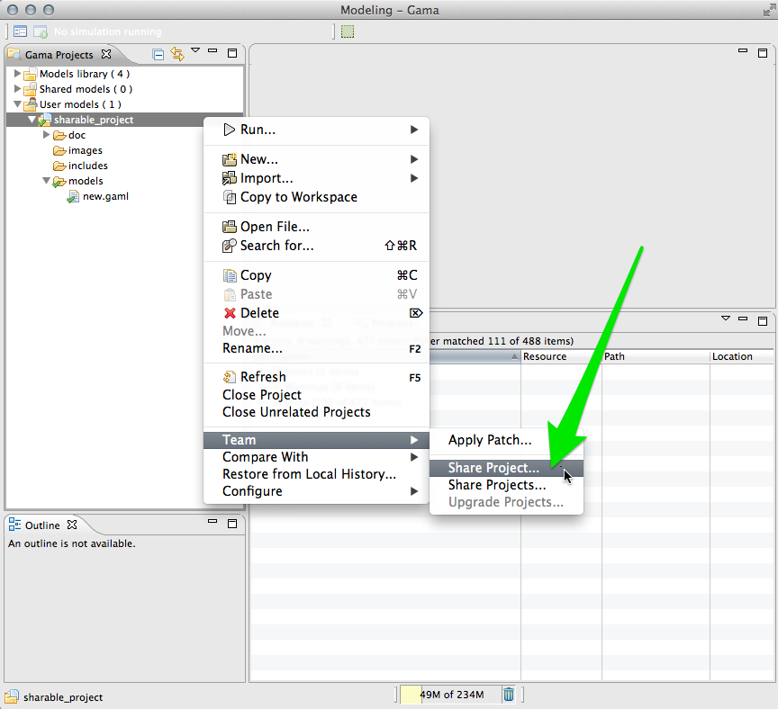

A dialog will then appear, asking you to enter a repository location. If you have already entered a repository location (in a previous sharing episode, for instance), you should be able to choose it from a list of existing locations. We suppose in this example that we enter the address and authentification information for the GAMA Models Repository (from which the "Shared Projects" category takes its information). If you plan to use another repository (with your co-workers, on a site like SourceForge or GoogleCode, etc.), these information will of course be different.

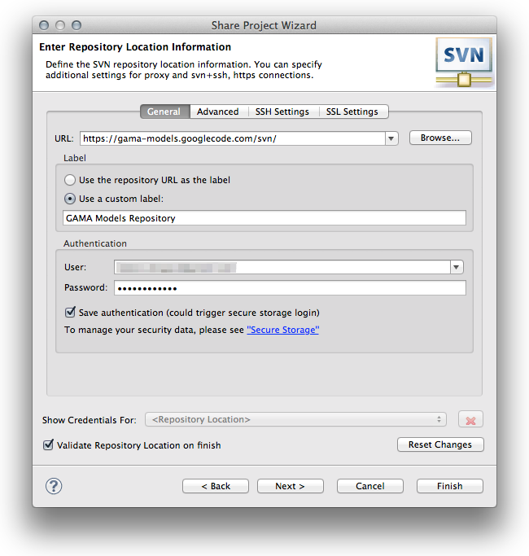

Once the repository location is validated, GAMA asks you for the name and structure to use for sharing the project on the repository. Always try to use "Simple Mode" if possible.

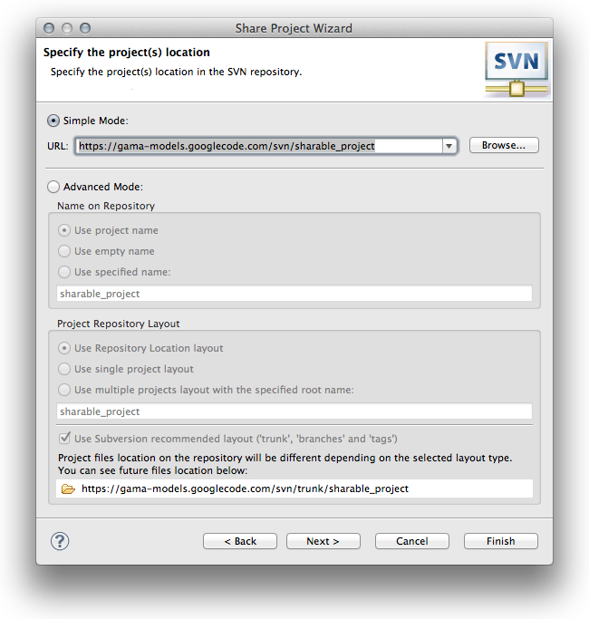

GAMA will then begin to _commit_ the project (i.e. to create its initial structure in the repository). You can enter a comment at that stage, to easily identify the contents of this operation when someone will want to browse the changes made to the repository.

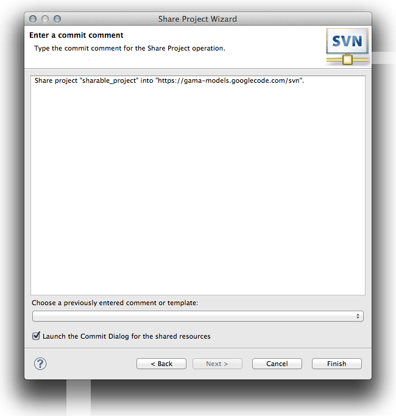

Creating the project structure on the repository takes a few seconds.

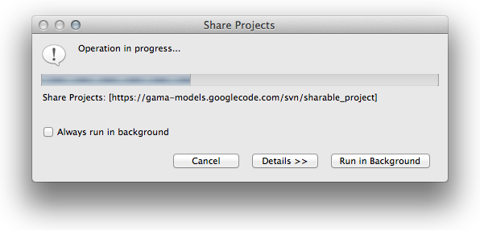

This phase is followed by a second, more important, _commit_, this time of the contents of the project. All the files present in the project will be copied to the repository. Once again, a comment can be entered at that stage.

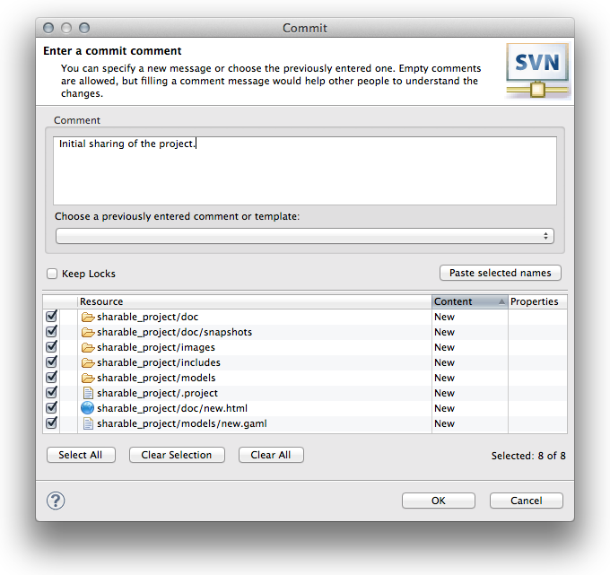

GAMA displays a dialog while the files are individually copied to the repository.

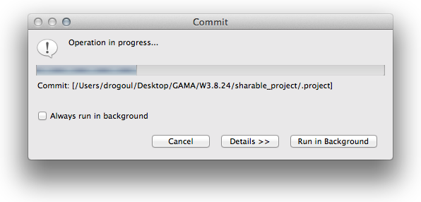

Once the initial sharing is over, the project sports new information in the navigator, namely its repository and _revision number_ (i.e. a number beginning at 0 and incremented each time a change is made to the repository — not to the project).

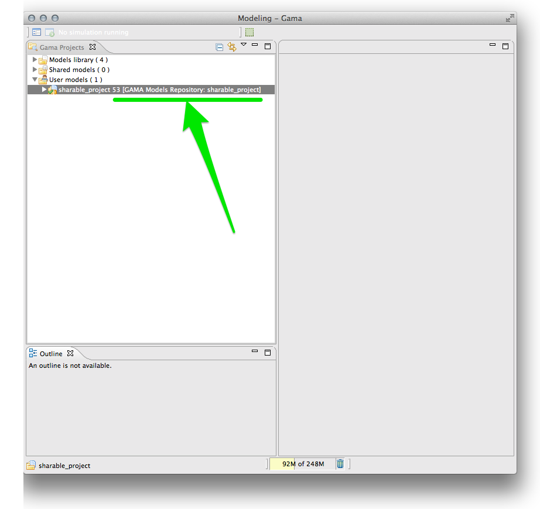

## Committing Local Changes

What happens when the shared project is locally modified, for example if we add a new model file to it ? You can see on the picture below that this file sports a different icon (with a question mark), indicating that it has no sharing information on its own (i.e. it does not exist in the repository but only locally). A modified, but already shared, file would have another different icon (with a star) to indicate that the local version is different from the one committed to the repository a while ago.

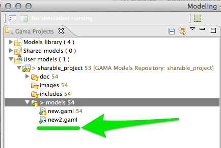

If these modifications constitute supplementary information that have to be shared as well, it can be done by using, again, the "Team" sub-menu (this time much more furnished, but explaining all the individual options is beyond the scope of this documentation. Please refer to the "official" documentations available on the top of this page). Here, we now invoke the "Synchronize with Repository" command. This command allows to browse the incoming (i.e. from the repository) and outgoing (i.e. from the platform) changes and it is always a good idea to use it instead of directly invoking "Commit.." or "Update…".

Selecting this command makes a new view (called "Synchronize") appear in the user interface. This view displays all the changes in both the repository and the platform, and indicates which files should be committed (sent to the repository) or updated (downloaded from the repository) in order for the two projects to be _synchronized_. Here, we see that the new model file is identified as a possible file to commit. In particular, GAMA does not identify any conflicts (which can happen when files are modified on both sides, and which must be solved manually).

Selecting the new model file, we can then safely apply "Commit.." to it from its contextual menu.

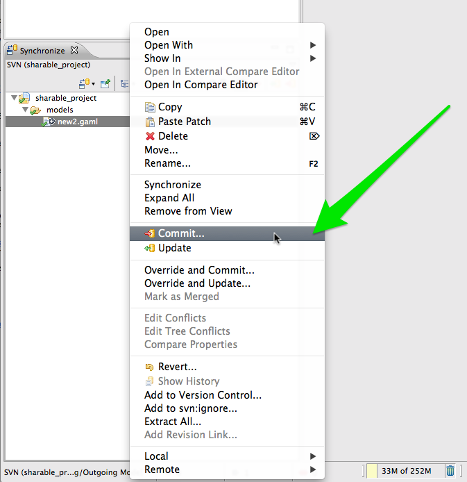

GAMA opens a dialog listing all the outgoing changes and asks for a comment.

Once the commit is over, the new model file has disappeared from the "Synchronize view" (as it is now synchronized with its counterpart in the repository) and sports the same information as the others (with a difference: its _revision number_ is logically higher).

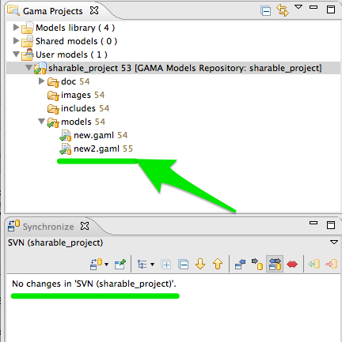

Updating, i.e. applying incoming changes to the local copy of the projects or files, follows the same logic (except that "Update…" must be invoked in that case).

## Sharing project within GAMA
GAMA developers can share directly their project within GAMA "shared models"  element in the "Gama projects" tab. To do so one needs to upload its model to the gama-models svn (within the "trunk" directory : https://gama-models.googlecode.com/svn/trunk). A short description of the model is also required: create an **html** file within the _doc_ directory named after your project name.