# Validation of Models


When editing a model, GAMA will continuously validate (i.e. _compile_) what the modeler is entering and indicate, with specific visual affordances, various information on the state of the model. This information ranges from documentation items to errors indications. We will review some of them in this section.


## Syntactic errors
These errors are produced when the modeler enters a sentence that has no meaning in the grammar of GAML (see [the documentation of the language](G__GamlLanguage)). It can either be a non-existing symbol (like "globals" (instead of _global_) in the example below), a wrong punctuation scheme, or any other construct that puts the parser in the incapacity of producing a correct syntax tree. These errors are extremely common when editing models (since incomplete keywords or sentences are continuously validated). GAMA will report them using several indicators: the icon of the file in the title of the editor will sport an error icon and the gutter of the editor (i.e. the vertical space beside the line numbers) will use error **markers** to report two or more errors: one on the statement defining the model, and one (or more) in the various places where the parser has failed to produce the syntax tree. In addition, the toolbar over the editor will turn red and indicate that errors have been detected.

 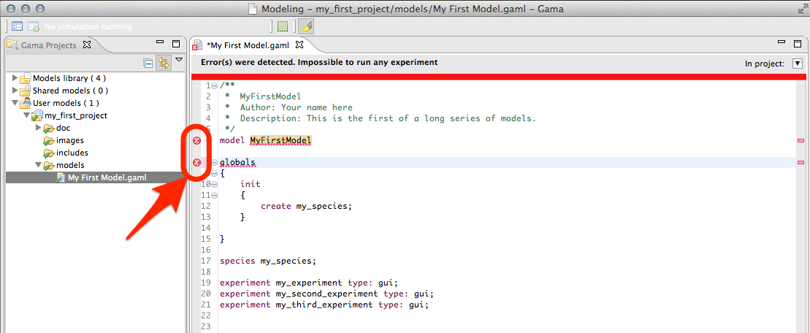 

Hovering over one of these **markers** indicates what went wrong during the syntactic validation. Note that these errors are sometimes difficult to interpret, since the parser might fail in places that are not precisely those where a wrong syntax is being used (it will usually fail **after**).

 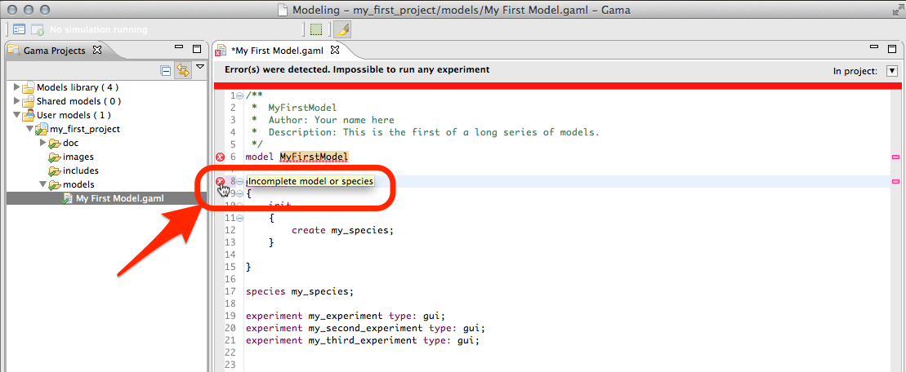 


## Semantic errors
When syntactic errors are eliminated, the validation enters a so-called semantic phase, during which it ensures that what the modeler has written makes sense with respect to the various rules of the language. To understand the difference between the two phases, take a look at the following example.

This sentence below is **syntactically** correct:
```
species my_species parent: my_species;
```
But it is **semantically** incorrect because a species cannot be parent of itself. No syntactic errors will be reported here, but the validation will fail with a **semantic** error.

 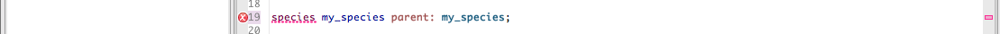 

Semantic errors are reported in a way similar to syntactic errors, except that no **marker** are displayed beside the model statement. The compiler tries to report them as precisely as possible, underlining the places where they have been found and outputting hopefully meaningful error messages. In the example below, for instance, we use a wrong number of arguments for defining a square geometry. Although the sentence is syntactically correct, GAMA will nevertheless issue an error and prevent the model from being experimentable.

 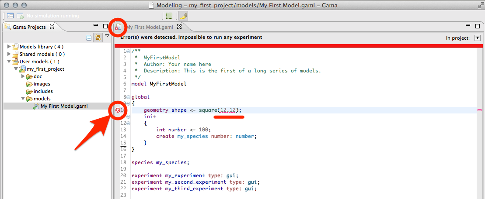 

The message accompanying this error can be obtained by hovering over the error **marker** found in the gutter (multiple messages can actually be produced for a same error, see below).

 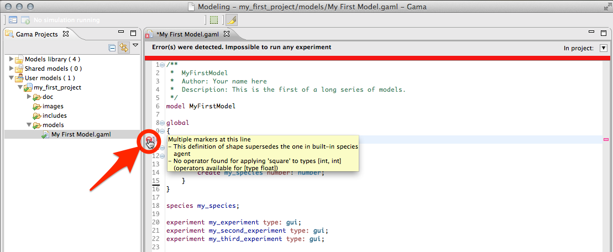 

While the editor is in a so-called _dirty_ state (i.e. the model has not been saved), errors are only reported locally (in the editor itself). However, as soon as the user saves a model containing syntactic or semantic errors, they are "promoted" to become workspace errors, and, as such, indicated in other places: the file icon in the _Navigator_, and a new line in the _Errors_ view.

 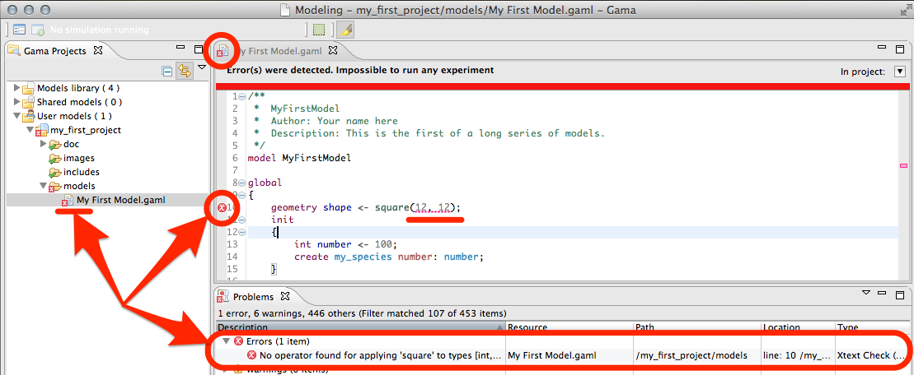 


## Semantic warnings

The semantic validation phase does not only report errors. It also outputs various indicators that can help the modeler in verifying the correctness of his/her model. Among them are **warnings**. A warning is an indication that something is not completely right in the way the model is written, although it can _probably_ be worked around by GAMA when the model will be executed. For instance, in the example below, we pass a string argument to the facet "number:" of the "create" statement. GAMA will emit a warning in such a case, indicating that "number:" expects an integer, and that the string passed will be casted to int when the model will be executed. Warnings are to be considered seriously, as they usually indicate some flaws in the logic of the model.

 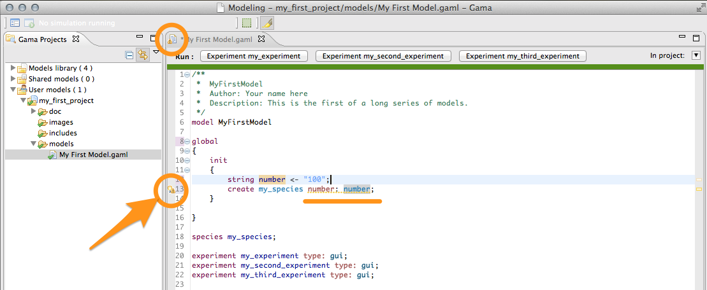 

Hovering over the warning **marker** will allow the modeler to have access to the explanation and hopefully fix the cause of the warning.

 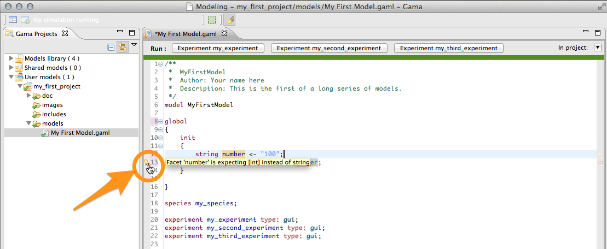 


## Semantic information
Besides warnings, another type of harmless feedback is produce by the semantic validation phase: information **markers**. They are used to indicate useful information to the modeler, for example that an attribute has been redefined in a sub-species, or that some operation will take place when running the model (for instance, the truncation of a float to an int). The visual affordance used in this case is voluntarily discrete (a small "i" in the editor's gutter).

 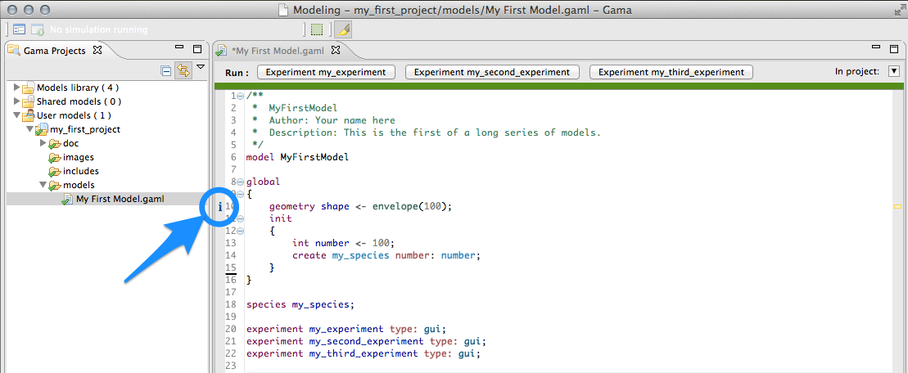 

As with the other types of **markers**, information markers unveil their messages when being hovered.

 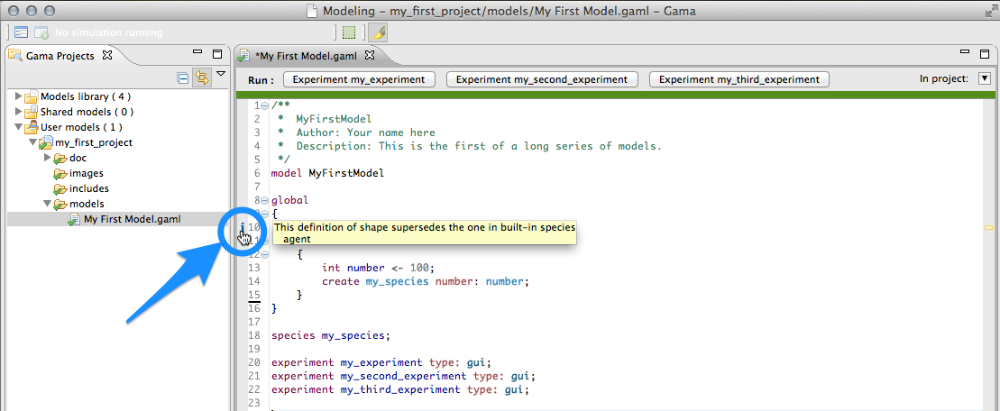 


## Semantic documentation
The last type of output of the semantic validation phase consists in a complete documentation of the various elements present in the model, which the user can retrieve by hovering over the different symbols. Note that although the best effort is being made in producing a complete and consistent documentation, it may happen that some symbols do not produce anything. In that case, please report a new Issue [here](https://code.google.com/p/gama-platform/issues/list).

 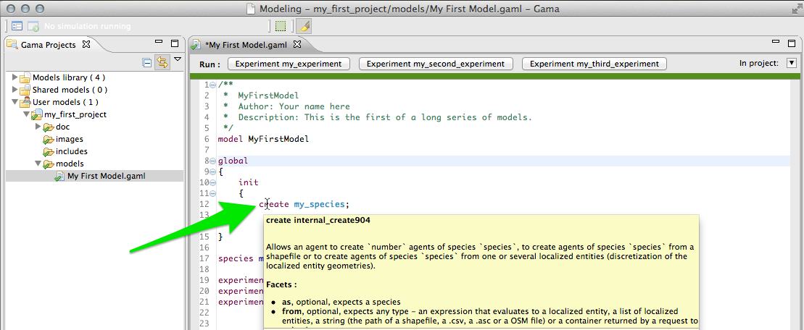 


## Changing the visual indicators
The default visual indicators depicted in the examples above to report errors, warnings and information can be customized to be less (or more) intrusive. This can be done by choosing the "Preferences…" item of the editor contextual menu and navigating to "General > Editors > Text Editors > Annotations". There, you will find the various **markers** used, and you will be able to change how they are displayed in the editor's view. For instance, if you prefer to highlight errors in the text, you can change it here.

  

Which will result in the following visual feedback for errors:

 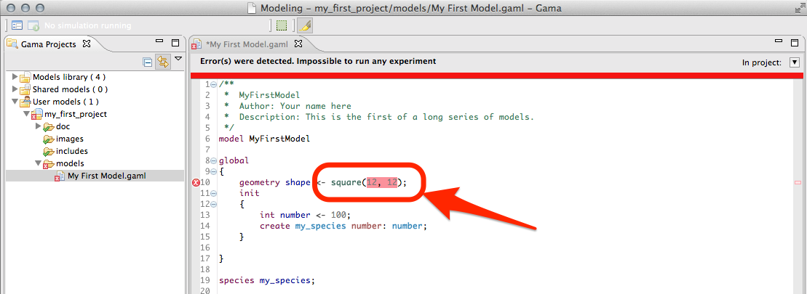 


## Errors in imported files

Finally, even if your model has been cleansed of all errors, it may happen that it refuses to launch because it imports another model that cannot be compiled. In the following screenshot, "My First Model.gaml" imports "My Imported Model.gaml", which sports a syntactic error.

 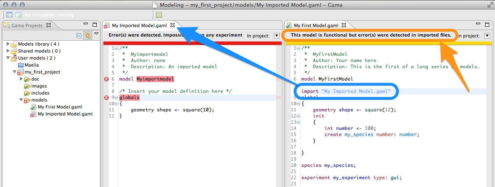 

In such a case, the importing model refuses to compile (although it is itself valid) and to propose experiments. There are cases, however, where the same importation can work. Consider the following example, where, this time, "My Imported Model.gaml" sports a semantic error in the definition of the global 'shape' attribute. Without further modifications, the use case is similar to the first one.

 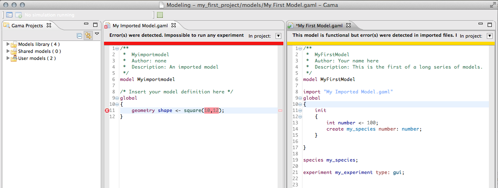 

However, if "My First Model.gaml" happens to redefine the _shape_ attribute (in global), it is now considered as valid. All the valid sections of "My Imported Model.gaml" are effectively imported, while the erroneous definition is superseded by the new one.

 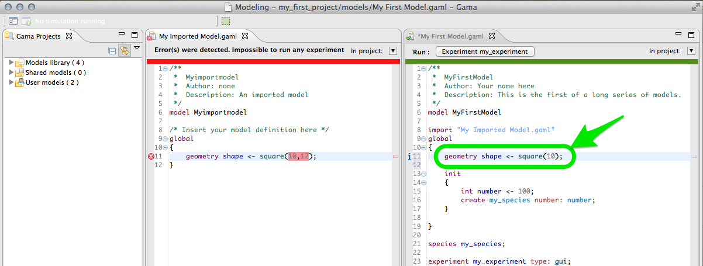 

This process is described by the information marker next to the redefinition.

 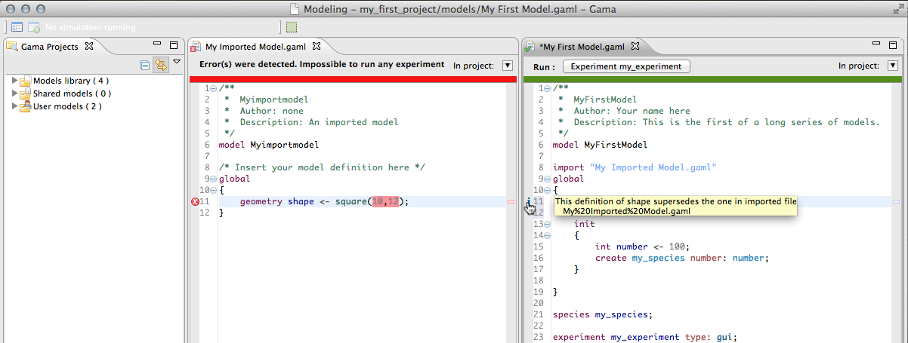 


## Cleaning models
It may happen that the metadata that GAMA maintains about the different projects (which includes the various **markers** on files in the workspace, etc.) becomes corrupted from time to time. This especially happens if you frequently switch workspaces, but not only. In those (hopefully rare) cases, GAMA may report incorrect errors for perfectly legible files.

When such odd behaviors are detected, or if you want to regularly keep your metadata in a good shape, GAMA proposes a menu command called "Clean…", that can be found in the "Project" menu.

 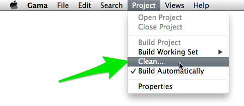 

Invoking this command results in GAMA removing all the validation metadata associated with projects and provoking a complete "re-build" of all the projects (_building_ here meaning validating the models, essentially). This command can be invoked on the current selected project, or on all projects at once (it is recommended, if you suspect odd behaviors, to do the latter).

 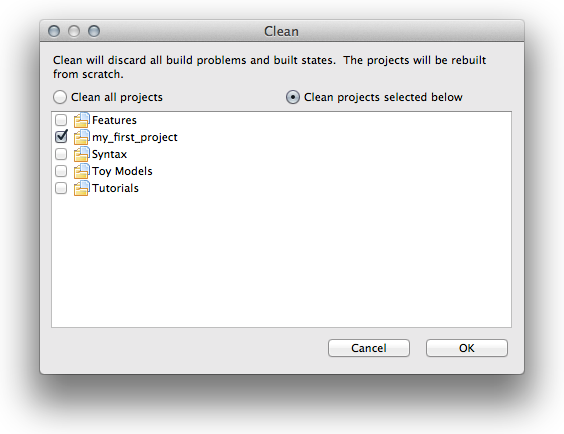 

Depending on the size of your projects, the process can take more or less time (a few seconds for the stock version without user projects). Note that GAMA, from time to time, will invoke such complete "re-builds" if it estimates that you have modified too many models. But it doesn't remove the existing meta-data in this case.

This process will display the following dialog, that you can later suppress by enabling it to run in the background.

  

When running in the background, GAMA will report the progress of the building process in the bottom right-hand corner of the window. The small icon next to it enables to follow it more accurately (while still running in background)

 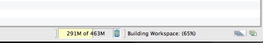 

This will open a new view, called _Progress_ in which other background processes (workspace management, memory management) will also report their progresses. This view can be opened and closed at will without provoking any trouble.

 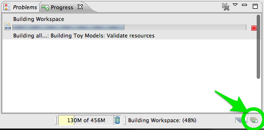 