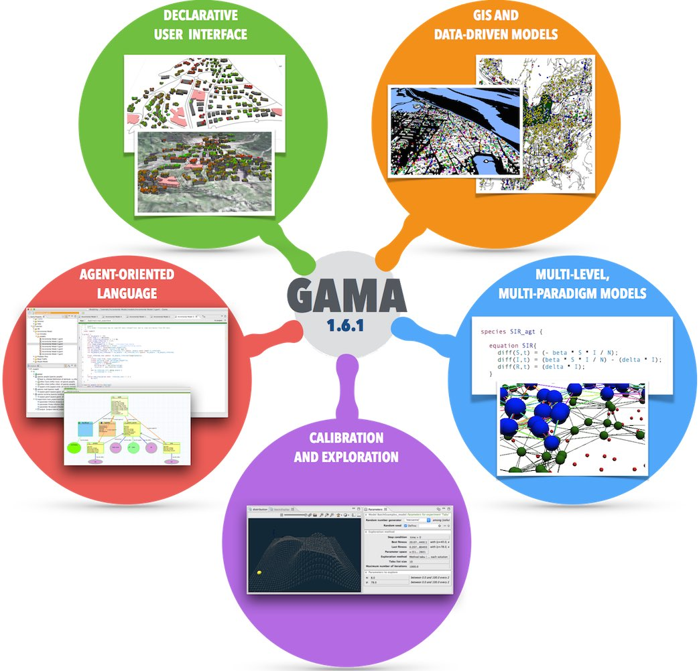

 

G A M A  is a modeling and simulation development environment for building spatially explicit agent-based simulations. Its latest version, 1.6.1, can be freely [G__Downloads downloaded] or [https://code.google.com/p/gama-platform/source/checkout built from source], and comes pre-loaded with several models, [G__Tutorials tutorials] and a complete [G__Overview on-line documentation].

 
G A M A  allows to:

 * Design, prototype and write models in the *[G__GamlLanguage GAML agent-oriented language]* and its optional *[G__GraphicalEditor graphical modeling tool]*.
 * Instantiate agents from any kind of dataset, including *[Tutorial__RoadTrafficTutorial GIS data]*, and execute *[G__RunningExperiments large-scale simulations]* (up to millions of agents). 
 * Couple discrete or continuous *topological layers*, multiple *[G__MultiLevel levels of agency]* and *multiple paradigms* (mathematical equations, control architectures, finite state machines).
 * Define *[G__DefiningExperiments rich experiments]* on models and explore their *[G__BatchExperiments parameters space]* for calibration and validation.
 * Design rich user interfaces that support deep inspections on agents, *[G__DefininUserInteraction user-controlled actions]* and panels, *[G__DefiningDisplays multi-layer 2D/3D displays]* and multiple agent aspects.

G A M A  is developed by several teams under the umbrella of the IRD/UPMC international research unit [UMMISCO](http://www.ummisco.ird.fr/):

* [MSI Research Team](http://www.ifi.auf.org/site/content/view/35/46/lang,french/), Vietnam National University, Hanoi, Vietnam (2007 − 2014)
* [UMR 6228 IDEES](http://www.umr-idees.fr), CNRS/University of Rouen, France (2010 − 2014)
* [UMR 5505 IRIT](http://www.irit.fr), CNRS/University of Toulouse 1, France (2010 − 2014)
* [DREAM Research Team](http://www.cit.ctu.edu.vn), University of Can Tho, Vietnam (2011 − 2014)
* [UMR 8623 LRI](http://www.lri.fr), CNRS/University Paris-Sud, France (2011 - 2014)

------
==Recent activity==
<wiki:gadget url="gadgets/feed.xml" width="80%"  height="600px" border="0"/>