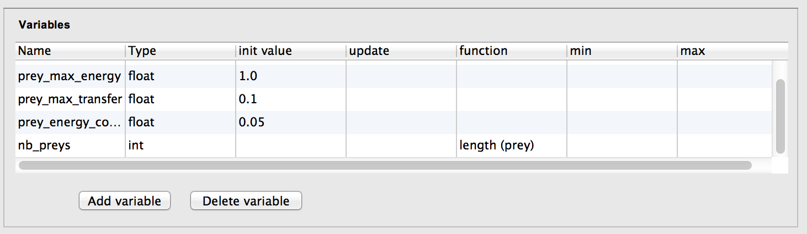
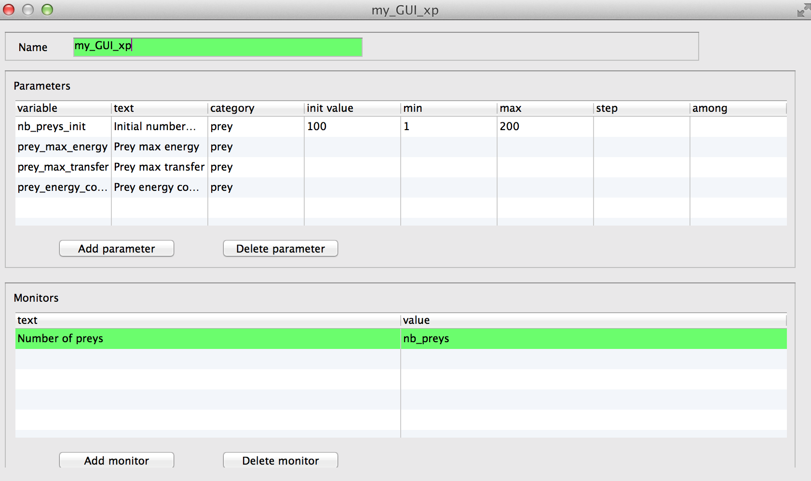
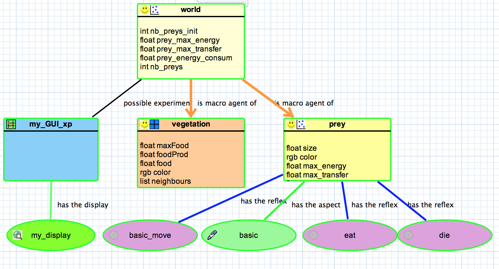

# 4. Inspectors and Monitors
This fourth step Illustrates how to monitor more precisely the simulation. Practically, we will define monitors to follow the evolution of specific variables (or expression) whereas inspector allows to follow the state of a given agent (or a species).

## Formulation
  * Adding of a monitor to follow the evolution of the number of prey agents

## Model Definition

### global variable
We add a new global variable:
  * **nb\_preys** : returns, each time it is called, the current number of (live) prey agents

To do so we use the **function** facet which returns the value of **expression**, each time it is called..
We use as well the operator **length** that returns the number of elements in a list.

Thus, In the _World_, we add the **nb\_preys** global variable as follows:

### monitor
A monitor allows to follow the value of an arbitrary expression in GAML. It has the following facets:
  * value: mandatory, its that value will be displayed in the monitor.
  * refresh\_every: int, optional : number of simulation steps between two computations of the expression (default is 1).

To define a monitor double click on your _GUI experiment_ item  then _Add monitor_. Our monitor will be called **Number of preys** (text field) and its value **nb\_preys** .

### inspector

Inspectors allow to obtain informations about a species or an agent. There are two kinds of agent information features:
  * Species browser: provides informations about all the agents of a species. Available in the Agents menu.

  * Agent inspector: provides information about one specific agent. Also allows to change the values of its variables during the simulation. Available from the Agents menu, by right\_clicking on a display, in the species inspector or when inspecting another agent. It provides also the possibility to «highlight» the inspected agent.

## Complete Model
Please note that visually the 4th step complete model is very similar to the 3rd as monitors are not shown, only the new variable _nb\_preys_ is visible.

