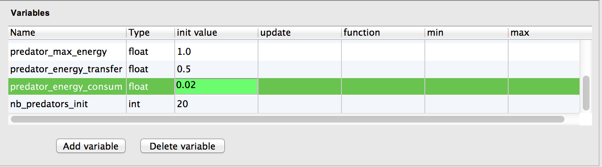
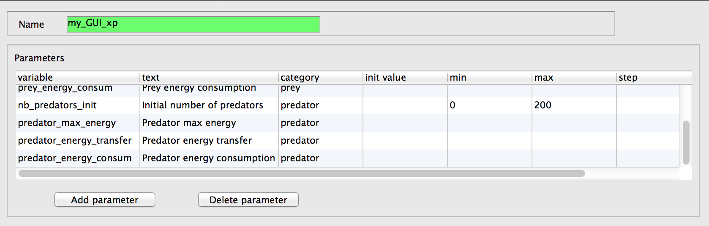
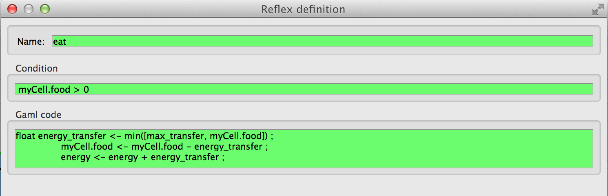
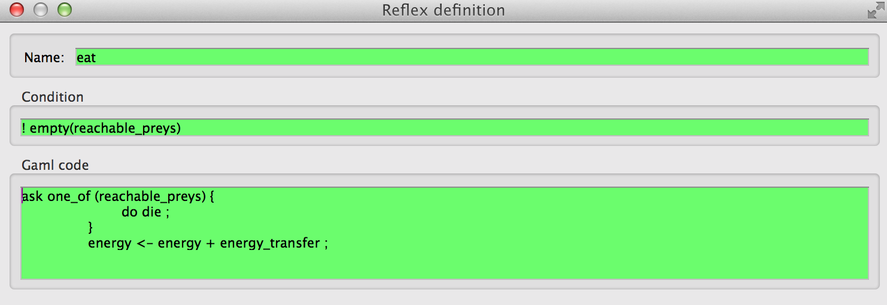
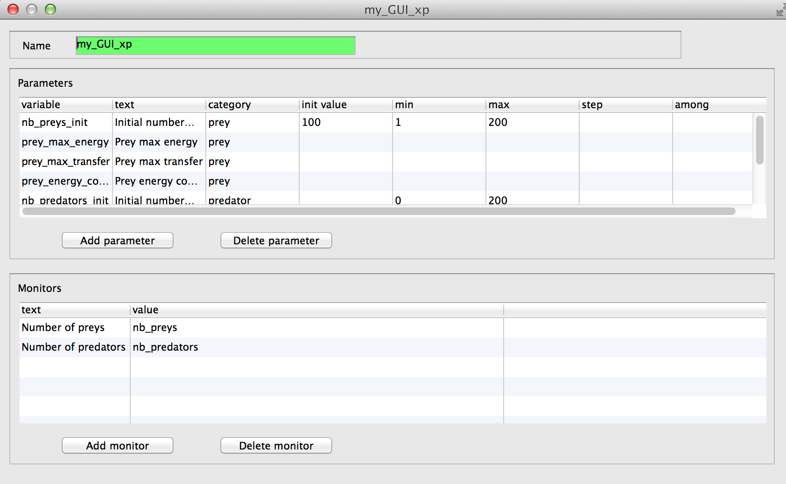
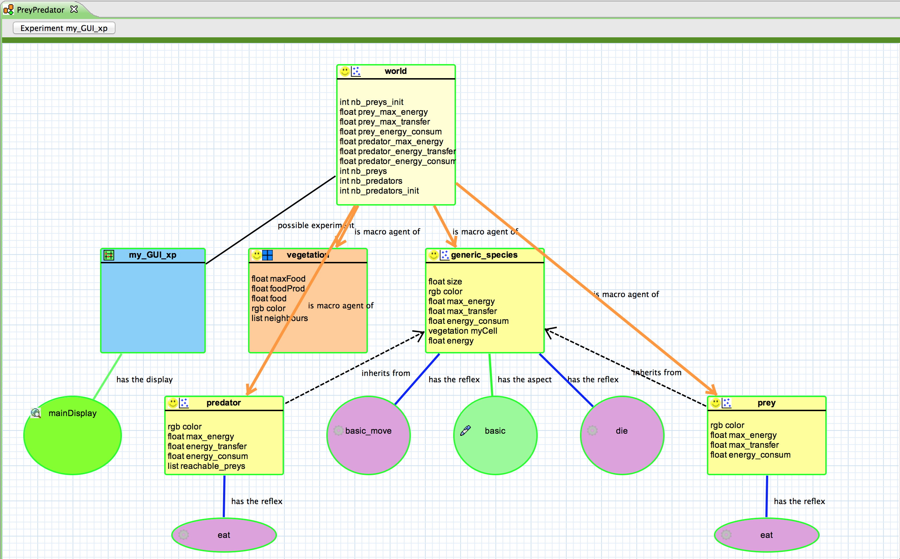

# 5. Predator Agent

This fifth step Illustrates how to use parent species. Indeed, prey and predators share a few common features thus we will define a generic species that will regroup all the common elements (variables, behaviors and aspects) between the prey and the predator species.


## Formulation
  * Definition of a new generic species: generic\_species
  * Definition of a new species: predator
  * predator agents move randomly
  * At each simulation step, a predator agent can eat a prey that is localized at its grid cell


## Model Definition

### parameters

We add four new global variables (i.e. edit the _World_  item) related to predator agents:
  * The initial number of predator agents : _nb\_predators\_init of type int and initial value of 20
  * The max energy of the predator agents :_predator\_max\_energy_of type float and initial value of 1.0
  * The energy gained by a predator agent while eating a prey agent  :_predator\_energy\_transger_of type float and initial value of 0.5
  * The energy consumed by a predator agent at each time step  :_predator\_energy\_consum_of type float and initial value of 0.02_





We define then the four corresponding parameters, all of them regrouped in the "Predator" category, in the experiment as follows:
**nb\_predators\_init, text: "Initial number of predators", min : 0, max:200** predator\_max\_energy, text: "Predator max energy"
**predator\_energy\_transfer, text: "Predator energy transfer"** predator\_energy\_consum, text: "Predator energy consumption"





### Parent species

A species can have a parent species: it automatically get all the variables, skill and actions/reflex of the parent species. This offspring species will differentiate itself by adding new elements (variables, reflexes) to it or redefining the ones of the parent's species.

We define a species called **generic\_species** that is the parent of the species **prey** and **predator**:


In the present case, we can simply rename our _prey_ species as _generic\_species_ because what we have defined so far will be re-used by both _prey_ and _predator_ species. One exception is the **eat** reflex that will be different for the two species thus we delete it from the _generic\_species_.

In a more general situation, we would have defined first the generic species and then the offspring ones.


### prey species
Having our **prey** species renamed to **generic\_species**, we need to add a new **prey** species: use the _is\_composed\_of_ item from the palette, click on the _World_ and create a **prey** species. Then, we need to link it to our _generic\_species_, we use the _is\_parent\_of_ tool from the palette to do so (click on the _prey_ then _generic\_species_ to make the link).

We specialize the **prey** species from the **generic\_species** species:
  * definition of the initial value of the agent variables
    * max\_energy, type float, initial value : prey\_max\_energy
    * max\_transfer, type float, initial value: prey\_max\_transfer ;
    * energy\_consum, type float, initial value : prey\_energy\_consum ;

As we have deleted the **eat** reflex of our _generic\_species_, we need to recreate it for the _prey_ species (as we need did in [Tutorial\_\_GraphicModel\_step3](step3)):




### predator species
As done for the **prey** species, we specialize the **predator** species from the **generic\_species** species:
  * definition of the initial value of the agent variables
  * color of type rgb and initial value : "#red"
  * max\_energy of type float and initial value  :"predator\_max\_energy"
  * energy\_transfer of type float and initial value  :"predator\_energy\_transfer"
  * energy\_consum  of type float and initial value  :"predator\_energy\_consum"

  * definition of a new variable **reachable\_preys** consisting in the list of prey agents contains in myCell; compute at each simulation step (when the agent is activated).
  * reachable\_preys  of type `list<prey>` and initial value  :"prey inside (myCell)"
    * definition of the eat reflex: activated when **reachable\_preys** is not empty; choose one of the element of this list, ask it to die; and update the **predator** energy which translates in the following Gaml code:

```
		ask one_of (reachable_preys) {
			do die ;
		}
		energy <- energy + energy_transfer ;

```

And the following **condition**: ` ! empty(reachable_preys) `





Note that we used the **ask** statement. This statement allows to make a remote agent executes a list of statements.
Use of the ask statement as follows:
```
ask one_agent or ask agents_list
```

We used as well the **species/agent list inside geometry/agent** operator. This operator returns all the agents of the specified species (or from the specified agent list) that are inside the given geometry or agent geometry.


### global init block
Like in the previous model, in the init block of the model (in the _World_ item), we create nb\_predators\_init.


### monitor
Like in the previous model, we define a monitor to display the number of predator agents.

Definition of a global variable **nb\_predator** that returns the current number of **predator** agents:
**nb\_predators of type int and function equals to "length (predator)"**


Definition of the corresponding monitor:




## Complete Model


