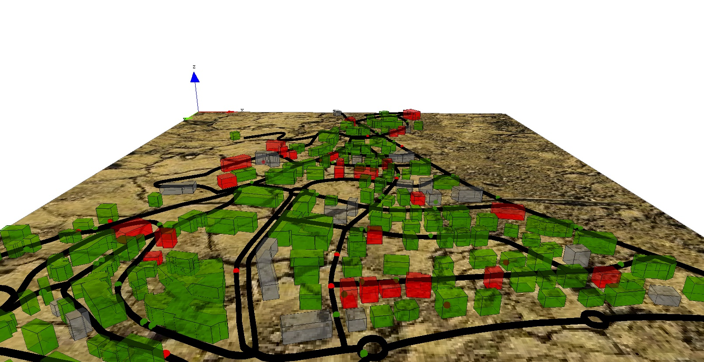

# Incremental Model

---

This tutorial has for goal to give an overview all most of the capabilities of GAMA. In particular, it presents how to build a simple model and the use of GIS data, graphs, 3D visualization, multi-level modeling and differential equations. All the files related to this tutorial (images and models) are available in the Models Library (project Tutorials/Incremental Model).

 

---

## Model Overview
The model built in this tutorial concerns the study of the spreading of a disease in a small city.
Three type of entities are taken into account: the people, the buildings and the roads.

We made the following modeling choice:
  * Simulation step: 1 minute
  * People are moving on the roads from building to building
  * People use the shortest path to move between buildings
  * All people have the same speed and move at constant speed
  * Each time, people arrived at a building they are staying a certain time
  * The staying time depends on the current hour (lower at 9h - go to work - at 12h go to lunch - at 18h - go back home)
  * Infected people are never cured

 

---

## Step List

This tutorial is composed of 7 steps corresponding to 7 models. For each step we present its purpose, an explicit formulation and the corresponding GAML code.

  1. [Simple SI Model](Tutorial__IncrementalModel_step1)
  1. [Charts](Tutorial__IncrementalModel_step2)
  1. [Integration of GIS Data](Tutorial__IncrementalModel_step3)
  1. [Movement on Graph](Tutorial__IncrementalModel_step4)
  1. [3D visualization](Tutorial__IncrementalModel_step5)
  1. [Multi-Level](Tutorial__IncrementalModel_step6)
  1. [Differential Equations](Tutorial__IncrementalModel_step7)