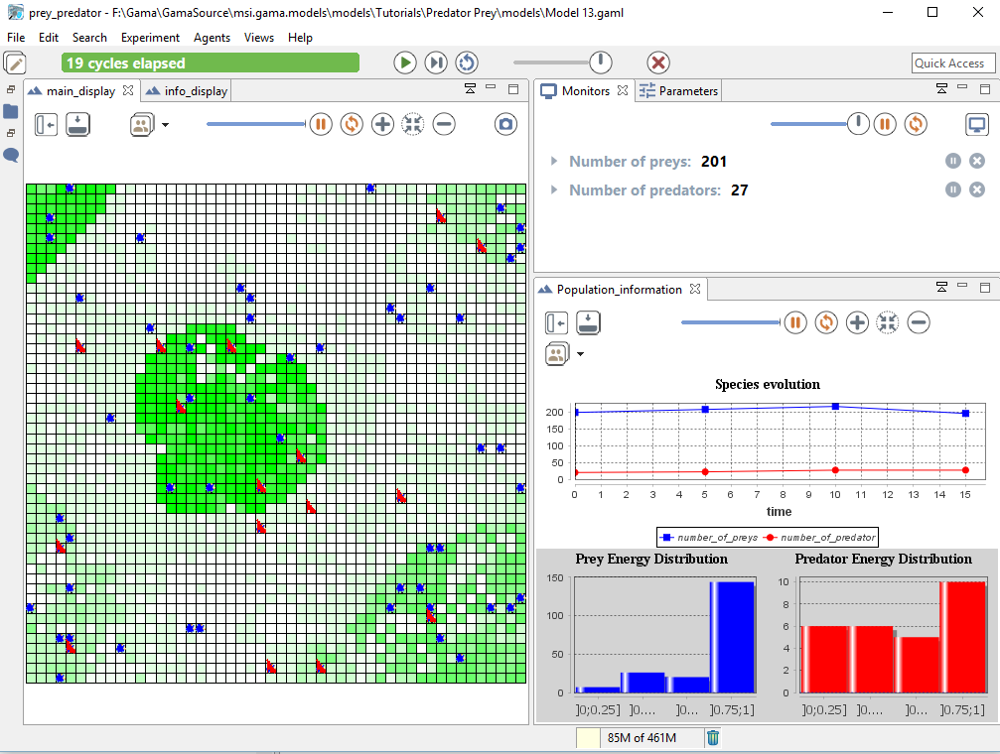

# Predator Prey

This tutorial presents the structure of a GAMA model as well as the use of a grid topology. In particular, this tutorial shows how to define a basic model, to define "grid agents" which are able to move within the constraints. It also introduce the displays and agents' aspect.

All the files related to this tutorial (images and models) are available in the Models Library (project Tutorials/Predator Prey).
## Content

## Model Overview
In this model, three types of entities are considered: preys, predators and vegetation cells. Preys
eat grass on the vegetation cells and predators eat preys. At each simulation step, grass grows on the vegetation cells. Concerning the predators and preys, at each simulation step, they move (to a neighbor cell), eat, die if they do not have enough energy, and eventually reproduce.

## Step List

This tutorial is composed of 12 incremental steps corresponding to 12 models. For each step we present its purpose, an explicit formulation and the corresponding GAML code of the model.

  1. [Basic model (prey agents)](https://github.com/gama-platform/gama/wiki/Content\Tutorials\Tutorials\PredatorPrey\PredatorPrey_step1.md)
  1. [Dynamic of the vegetation (grid)](https://github.com/gama-platform/gama/wiki/Content\Tutorials\Tutorials\PredatorPrey\PredatorPrey_step2.md)
  1. [Behavior of the prey agent](https://github.com/gama-platform/gama/wiki/Content\Tutorials\Tutorials\PredatorPrey\PredatorPrey_step3.md)
  1. [Use of Inspectors/monitors](https://github.com/gama-platform/gama/wiki/Content\Tutorials\Tutorials\PredatorPrey\PredatorPrey_step4.md)
  1. [predator agents (parent species)](https://github.com/gama-platform/gama/wiki/Content\Tutorials\Tutorials\PredatorPrey\PredatorPrey_step5.md)
  1. [Breeding of prey and predator agents](https://github.com/gama-platform/gama/wiki/Content\Tutorials\Tutorials\PredatorPrey\PredatorPrey_step6.md)
  1. [Agent display (aspect)](https://github.com/gama-platform/gama/wiki/Content\Tutorials\Tutorials\PredatorPrey\PredatorPrey_step7.md)
  1. [Complex behaviors for the preys and predators](https://github.com/gama-platform/gama/wiki/Content\Tutorials\Tutorials\PredatorPrey\PredatorPrey_step8.md)
  1. [Adding of a stopping condition](https://github.com/gama-platform/gama/wiki/Content\Tutorials\Tutorials\PredatorPrey\PredatorPrey_step9.md)
  1. [Definition of charts](https://github.com/gama-platform/gama/wiki/Content\Tutorials\Tutorials\PredatorPrey\PredatorPrey_step10.md)
  1. [Writing files](https://github.com/gama-platform/gama/wiki/Content\Tutorials\Tutorials\PredatorPrey\PredatorPrey_step11.md)
  1. [Image loading (raster data)](https://github.com/gama-platform/gama/wiki/Content\Tutorials\Tutorials\PredatorPrey\PredatorPrey_step12.md)