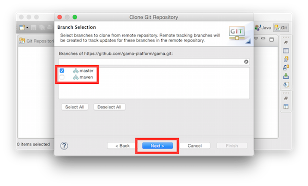
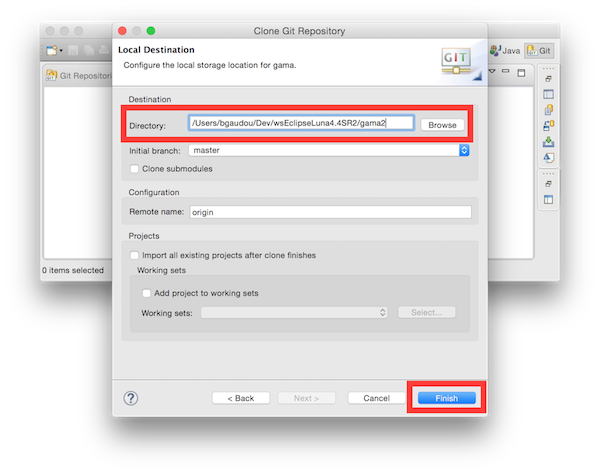
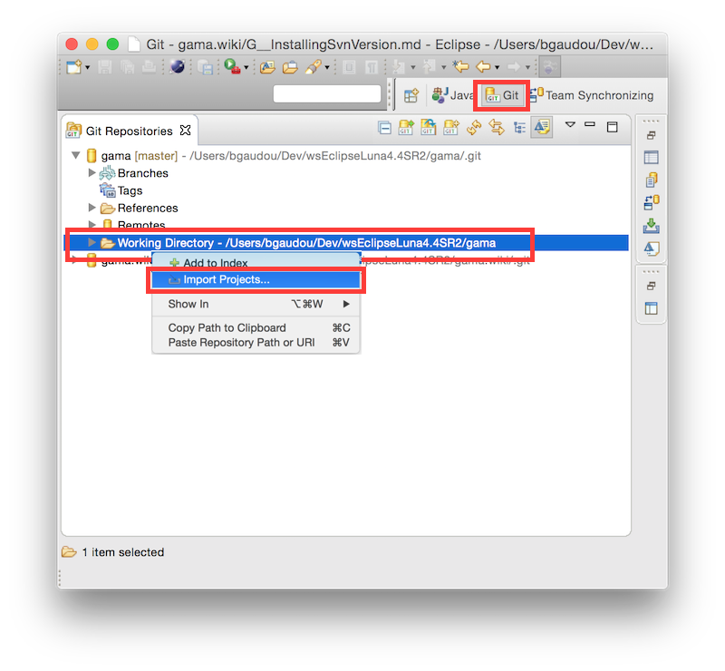
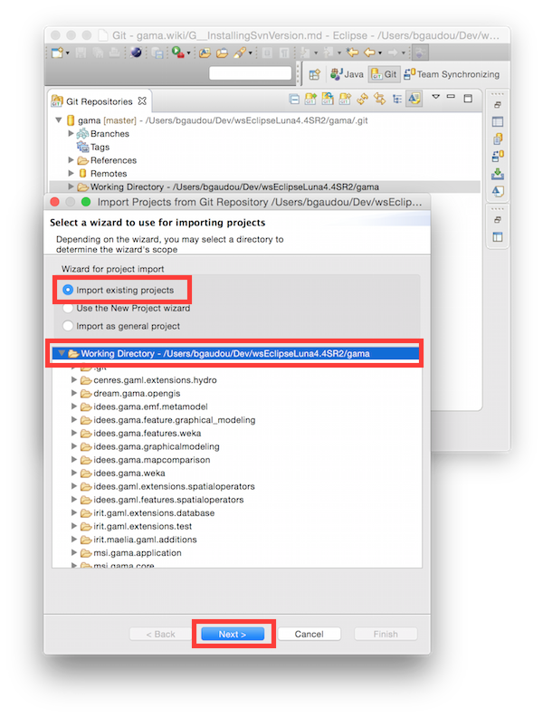
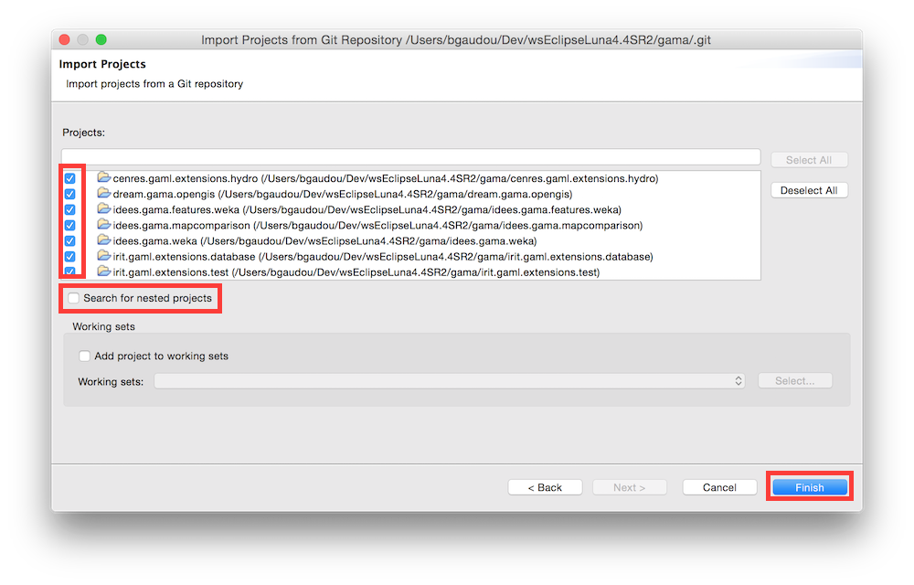

# Installing the GIT version

Tested on MacOS X (10.9 to 10.11), Windows (8 to 10) and Ubuntu 15.04 (Vivid)

_Important note: the current Git version is **not** compatible with the GAMA 1.6.1 release: if you plan to create plugins for this release, please download the source at revision r11988 (on Google Code) and [Eclipse following this procedure](https://github.com/mazarsju/gama_doc_17/wiki/WikiOnly/DevelopingExtensions/InstallingSvnOldVersions.md)_

## Install Eclipse Mars SR1

Download the ["Eclipse IDE for Java and DSL Developers"](http://www.eclipse.org/downloads/packages/eclipse-ide-java-and-dsl-developers/mars1) version. 

Unpack it and launch it. Please refer to this [link](http://help.eclipse.org/mars/index.jsp?nav=%2F0) for more information on running Eclipse.

**One important step** required for GAMA to correctly produce its supporting files once it will have been installed is to set the default encoding of the workspace to UTF-8. It can be done by selecting, in the Preferences, "General", then "Workspace", then "Text file encoding" and choosing "UTF-8" in the drop-down menu available in "Other:".

## Install GAMA source code

The source is to be downloaded from GitHub in two steps: by creating a local clone of the GitHub repository and then importing the different projects that constitute GAMA into the Eclipse workspace.

1. Open the Git perspective:
  * Windows > Perspective > Open Perspective > Other...
  * Choose `Git`

2. Click on "Clone a Git repository"

  * In **Source Git repository** window: 
    * Fill in the URI label with: `https://github.com/gama-platform/gama.git`
    * Other fields will be automatically filled in.
    
  * In **Branch Selection** windows, 
    * check the master branch 
    * Next

  * In **Local Destination** windows,
    * Choose a Directory (where the source files will be downloaded).
    * Everything else should be unchecked 
    * Finish

This can take a while...

### Import projects into workspace
You have now to import projects into the workspace (notice that the folders downloaded during the clone will neither be copied nor moved).

1. In the **Git perspective** and the **Git Repositories** view, Right-Click on "Working Directory" inside the `gama` repository, and choose "Import projects"

  * In the **Select a wizard to use for importing projects** window:
    * "Import existing projects" should be checked
    * "Working Directory" should be selected
    
  * In **Import Projects** window:
    * **Uncheck « Search for nested project »**
    * Check the projects you want to import
    * Finish

2. Go back to the Java perspective
3. Clean project (Project menu > Clean ...)

### Run GAMA
1. In the `msi.gama.application` plugin, open the `gama1.7.Eclipse3_8_2.product` file
2. Go to "Contents" tab and click on "Add required"
3. Go to "Overview" tab and click on Synchronize
4. Click on Launch an Eclipse Application

###GIT Tutorials
For those who want learn more about Git and Egit, please consult the following tutorials/papers

1. EGIT/User Guide http://wiki.eclipse.org/EGit/User_Guide
2. Git version control with Eclipse (EGIT) - Tutorial http://www.vogella.com/tutorials/EclipseGit/article.html
3. 10 things I hate about Git http://stevebennett.me/2012/02/24/10-things-i-hate-about-git/
4. Learn Git and GitHub Tutorial https://www.youtube.com/playlist?list=PL1F56EA413018EEE1