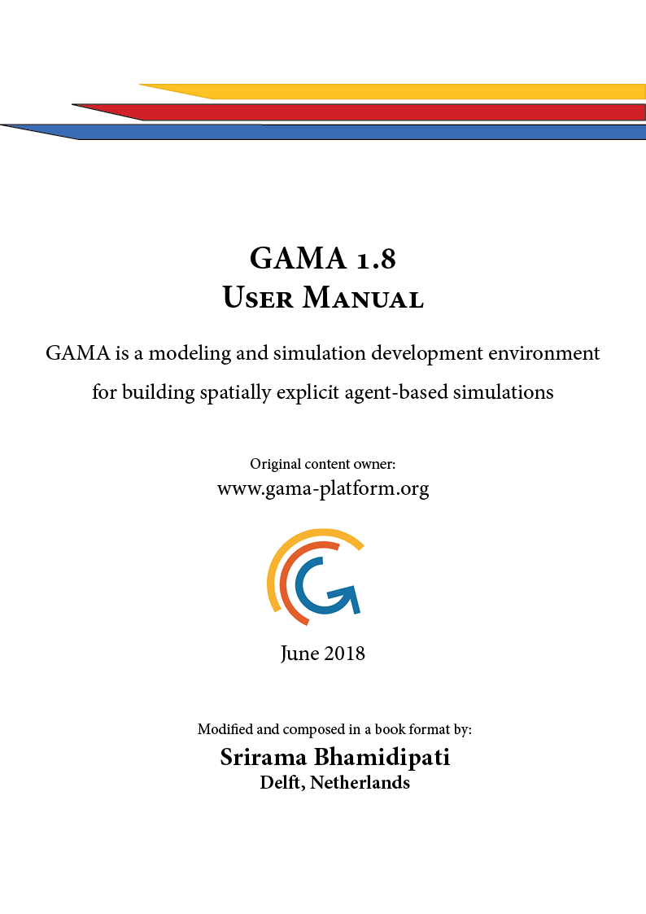

```{r fig.align='center', echo=FALSE, include=identical(knitr:::pandoc_to(), 'html'), }
options(width = 90)
knitr::include_graphics('cover.png', dpi = NA)
options(width = 90)
```


# Notice {-}

 * The content of this manual is from gama-platform.org website. I have only modified and edited very small portions of the content to give it a book format.

* This is a modified content and is not a 100% reproduction. If you do not find what you are looking for, go to the main website.

* I thank the Team of GAMA-Platform for giving me the permission to reproduce their content.

Cheers ! \
\
**Srirama Bhamidipati** \
*Delft, Netherlands* \
*2018*



